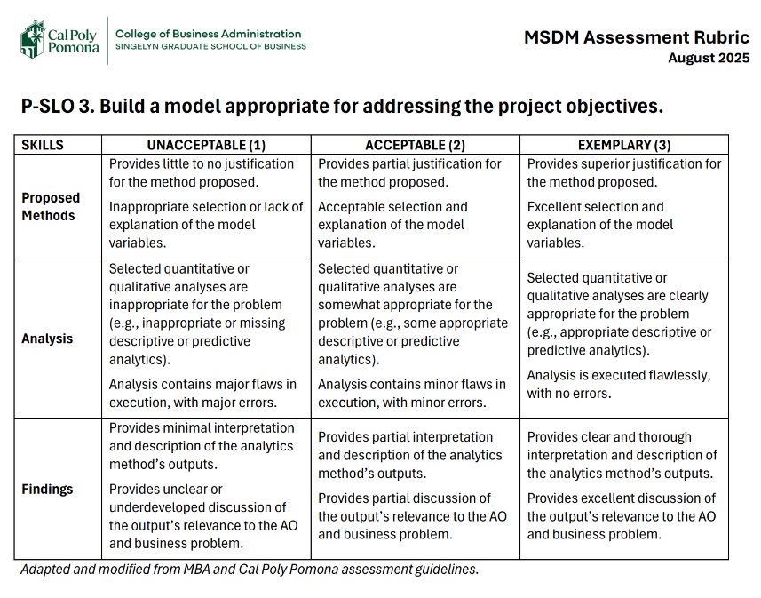
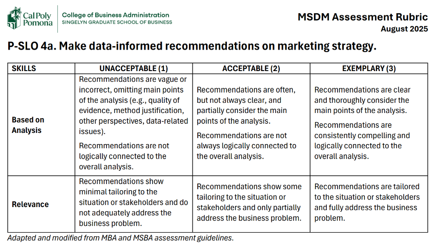

# CHAPTER 1: INTRODUCTION {#sec-ch1-introduction}

## Background and Business Problem

### Background (Georgia Monjarrez)

The Restaurant at Kellogg Ranch (RKR) is a student-operated restaurant located on the California State Polytechnic University, Pomona campus. Established in 1990, it provides students in The Collins College of Hospitality Management with practical experience managing and operating a restaurant while serving the public. Its dining experience features seasonal menus, ingredients grown on campus, and views of the university grounds [@therest].

RKR welcomes guests for lunch and dinner during posted operating periods and accommodates private events. Its website provides menu information, location details, operating hours, and access to an OpenTable reservation widget [@theresta]. These features allow prospective guests to explore the restaurant’s offerings and begin planning a visit, making the website a relevant part of the group’s digital marketing project.

### Business Problem (Luis Ahumada)

The Restaurant at Kellogg's Ranch is currently transitioning from primarily operating as a student-managed instructional restaurant, to a dual model that also includes stand-alone restaurant operation during different days of the week. Because these stand-alone service periods can't rely on state funding, RKR needs to find ways to generate consistent customer demand and revenue while also maintaining its educations Cal Poly Pomona mission. The Project proposal identifies several areas where RKR still needs evidence, including priority customer segments, barriers to visiting, effective messages and content, and the digital customer journey from awareness to reservation and repeat visits (Kwok 2026).

## Project Objectives

The project is designed to achieve the following objectives:

1.  Determine the RKR newsletter format that increases reservation click-rate.

2.  Identify what RKR guests value most and where improvements are needed to strengthen their overall dining experience.

3.  Develop an evidence-based Facebook marketing strategy designed to support reservation growth at The Restaurant at Kellogg Ranch.

4.  Recommend website content and navigation improvements that make dining information and the reservation process easier for prospective RKR guests to access.

5.  Strengthen RKR's Instagram strategy to improve audience engagement

## Analytics Objectives

### AO1. Newsletter Formatting and Click-Rate (Leeann Lewis-Waddell)

A/B test two RKR section formats in The Collins Concierge from October 2026 to June 2027, comparing “Reserve a Table” click rates and attributed OpenTable reservations between versions.

### AO2. Customer Experience Factors Associated With Overall Satisfaction (Carmen Jimenez)

- **PO2:** Identify what RKR guests value most and where improvements are needed to strengthen their overall dining experience.

- **AO2:** Using anonymous post-visit survey responses, compare RKR guests’ ratings of food quality, service quality, and atmosphere/physical environment to identify the strongest and weakest experience areas.

    - **Data Source:** Anonymous post-visit survey responses from RKR guests collected during Fall 2026, with Spring 2027 data added if available.

#### How to address AO2

The survey will measure food quality, service quality, atmosphere and physical environment, overall satisfaction, intention to return, and willingness to recommend using five-point rating items. The analysis will report response counts, percentages, and average ratings. Open-ended comments will be organized into recurring themes related to guest strengths and improvement opportunities.

#### How AO2 will help achieve PO2

The results will identify which parts of the RKR experience guests evaluate most positively and which areas may need improvement. These findings will help RKR prioritize customer-experience improvements that can support guest satisfaction, repeat visits, and positive recommendations.

### AO3. Facebook Content and Messaging Strategies and Reservation Performance (Luis Ahumada)

Analyze associations between facebook content and messaging strategies, engagement metrics, and OpenTable reservation activity.

### AO4. Website Content, Navigation, and Usability (Georgia Monjarrez)

Measure unassisted completion rates, median completion time, and five point ease of use ratings for finding RKR’s menu, operating hours, and reservation process, using 80% completion per task as a proposed benchmark.

### AO5. Instagram Content and Engagement Analysis (Spencer Conway)

This analytics objective will determine which Instagram content format produces the highest engagement rate for Restaurant at Kellogg Ranch. First, past posts will be grouped by format to establish a performance baseline. RKR will then test new content in selected formats and compare its performance with the baseline. Engagement rate will be calculated consistently using likes, comments, shares, and saves divided by reach, where Instagram Insights data are available. The findings will guide recommendations about which formats RKR should prioritize in future Instagram posts.

## Significance of the Topic

This project is important because it can help Restaurant at Kellogg Ranch better understand how its marketing efforts can increase awareness and engagement with its target audiences. Research has shown that restaurant social media content can influence customer inspiration and engagement, especially when restaurants use appealing outcome-focused food imagery [@lee2026]. RKR has a unique connection to The Collins College and Cal Poly Pomona, but that does not automatically mean students, faculty, staff, or people in the surrounding community know about the restaurant or what it offers. By looking at different marketing channels and customer touchpoints, our group can identify ways RKR can improve how it communicates with potential customers. Social media marketing activities such as interaction, entertainment, trendiness, and customization have been found to influence perceived value, purchase intention, and electronic word-of-mouth [@bushara2023]. Using data to evaluate current marketing efforts can also help the restaurant make decisions based on actual results instead of assumptions. The project can also support a more consistent and data-driven marketing strategy moving forward. Understanding how different audiences respond to different types of communication may help the restaurant use its marketing resources more effectively and build stronger connections with both the Cal Poly Pomona community and customers outside of campus.

------------------------------------------------------------------------

# Appendix

- [GitHub Repo](https://github.com/lewiswaddell/GP9CEP-RKR.Kwok.git)

- [Github Pages](https://lewiswaddell.github.io/GP9CEP-RKR.Kwok/)

------------------------------------------------------------------------

# CHAPTER 2: BACKGROUND AND ANALYTICS OBJECTIVES {#sec-ch2-background-and-analytics-objectives}

::: page-note
*(no specific page length guideline)*
:::

::: {.callout-tip .hl-yellow}
## 1. Guidelines For Client Consulting Project

- *If you are conducting a **Client Consulting Project type**, you have a company-specific analysis. Thus, follow the structure for Chapter 2 presented below.*

- For the **Client Consulting Project type**, Chapter 2 should include a comprehensive analysis of the client company and its industry, as well as an investigation of existing research frameworks/models that support the analytics objectives. The purpose of this chapter is to provide a thorough understanding of the client’s business context and to establish a strong foundation for the analytics objectives by grounding them in relevant theories and models.

- On the other hand, if you do not have a specific client company to analyze, you are completing a **Basic/Applied Academic Research Project type** where you are likely to benefit general public or the whole industry. In this case, Chapter 2 should follow the structure of the front end of an **academic research paper**. For details, refer to the [2. Guidelines for Basic/Applied Academic Research Project](#sec-ch2-for-basic-applied-academic-research-project).
:::

## Client (Company) Background

### Company Mission/Vision

### Core Competencies

### Value Propositions

### Business Objectives

## Description of the Client’s Current Marketing Program

### Marketing Team and Expertise

### Current Target Market

### Current Positioning and Perceptual Map

*Current Perceptual Map*

### Current Product/Services

### Current Pricing

### Current Marketing Channels

### Current Integrated Marketing Communications

## Description of the Company’s Current Digital Marketing Practices

### Brand Persona

### Digital Marketing Channels/Medium

#### Website and Landing Page

#### Keyword Research and SEO

#### Email Marketing

#### Social Media Posting

#### Paid Search Advertising

#### Social Media Advertising

#### Display advertising

### Other digital marketing channels & tactics

#### Conversion Rate Optimization (CRO)

#### Mobile Application

#### Affiliate Marketing

#### Influencer Campaigns

### Allocation of Resources to Customer-Influence Efforts

#### Demand Generation

#### Demand Harvesting

#### Loyalty Building

### Analytics Infrastructure

## Competitive Analysis

### Industry Size

#### Number of Companies

#### Number of Employees

#### Annual Revenue and Key Financial Information

#### Existence of Dominant Players and Competitors

#### Market Share of Each Major Player

### Industry Outlook

#### Industry Life Cycle

#### Future Sales/Profit Growth Outlook

### Key Competitors and Their Digital Marketing Strategies

#### Target Market

#### Positioning

#### Website and Landing Page

#### Keyword research and SEO

#### Email Marketing Strategy

#### Social Media Posting

#### Paid Search Advertising

#### Social Media Advertising

#### Display Advertising

#### Conversion Rate Optimization (CRO)

#### Mobile Application

#### Affiliate Marketing

#### Influencer Campaigns

#### Summary Table of Comparison

## Customer Analysis

### Segments and Their Brief Justification

*Develop a profile of customers for each segment in terms of demographics, psychographics, benefits sought, behavioral patterns, etc.*

#### Segment Name A

#### Segment Name B

#### Segment Name C

#### Segment Name D

#### **Summary Table of Segments**

*In the table, each column should represent a segment, and each row should represent a customer characteristic (e.g., demographics, psychographics, benefits sought, behavioral patterns). The cell descriptions should indicate the profile of customers in each segment for each characteristic.*

### Segment Analysis

*Evaluate the potential for each segment on such criteria as identifiability, actionability, substantiality, and accessibility.*

#### **Summary Table of Segment Evaluation**

*Based on the segment evaluation, identify the most attractive segment(s) to target and justify your choice.*

*In the table, each column should represent a segment, and each row should represent an evaluation criterion, plus overall attractiveness. The cell values should indicate how well each segment meets each criterion, using a consistent rating system (e.g., high, medium, low or a numerical scale).*

## SWOT Analysis

### Strengths

### Weaknesses

### Opportunities

### Threats

### **Summary: SWOT quadrants**

## Investigation of Currently Available Research Framework/Model {#sec-investigation-of-currently-available-research-frameworkmodel}

### AO1. Newsletter Formatting and Click-Rate (Leeann Lewis-Waddell)

#### Existence of Well-established Models

Analytics Objective 1 intends to A/B test revisions of the current advertising for the Restaurant at Kellogg Ranch within The Collins Concierge, the department’s weekly newsletter. Specifically, it will test if an image-based or video-based ad will increase "Reserve a Table" clicks in comparison to the current text-only format. After extensive research, three established frameworks inform how that test will be built and executed. AO1 will examine the email response process, visual attention and heuristics, and cognitive load and information overload.

Email marketing response occurs in a sequence, wherein a reader first sees a message, engages with it, and then chooses whether to act on it. Hartemo's newsletter testing model focuses on this response process, linking the factors that affect response to the metrics that measure each step [@hartemo2016]. This study tests eight format variations against a control group. The format of this analysis easily applies directly to the comparison of image and video templates against RKR's current section, which employs a controlled format test with a no-graphic baseline.

A review of Kumar's framework divides newsletter success into relational metrics, such as opens and clicks, and transactional metrics, such as purchases [@kumar2021]. Drawing on 811 newsletters sent to 19,678 loyalty program members, the study determines that design significantly shaped response, and clicks had the strongest relationship to eventual purchase [@kumar2021]. This point supports using click-through rate as AO1's primary metric, with reservations as the secondary, validating measure. With respect to RKR, Kumar’s sequence would apply to three measurable stages: newsletter views in Canva, "Reserve a Table" clicks, and OpenTable reservations.

One point of note: the response process also exposes a gap AO1 has to account for. Since RKR welcomes walk-ins and accepts Bronco Bucks, some readers will move from acknowledging the new template section and move directly to a visit without ever clicking. Therefore, version-specific links or perhaps a "How did you hear about us?" question at booking help capture that path, but would require additional points in the customer journey to address this variable.

As can be expected, readers do not scan a newsletter evenly or in its entirety. Described in detail by Kumar, visual heuristics guide where the eye lands and subsequently what gets clicked. This study details how newsletter readers follow a U-shaped pattern rather than the Z-pattern typical of web pages. It also outlines how the upper-left region produces higher CTR than links placed elsewhere [@kumar2018]. In the current RKR section, “view the menu” is a clickable link at the top center while the "Reserve a Table" button sits at the bottom, below the hours. Because placement carries its own documented effect, both test versions keep the button in the same position; otherwise a change in clicks could come from placement rather than media. Using current metrics as a baseline, AO1 will test relocation of the clickable “Reserve a Table” button for the remainder of the fall, and media additions through the sixteen weeks of Spring.

With regard to adding media to the RKR section of The Collins Concierge, Imagery is known to compete strongly for attention once an email is open. Skourou’s study using eye-tracking technique and tools found that large images captured more attention than discount codes and prices in promotional emails. Notably, what readers chose to look at mapped to their purchase decisions [@skourou2024]. This supports visual content as AO1's main test variable, since the current section depends on a block of text to communicate its key details, specifically food and its accompanying atmosphere. On the contrary, the study also shows that a strong image or video could consequently draw focus away from the button it is meant to support.

Industry guides from Semrush and OpenTable support the aforementioned notion. High-quality images are most recommended, coupled with contrasting CTAs, and testing one variable at a time over at least two weeks [@go2024]. OpenTable's restaurant guide adds that key information belongs at the top, supported by strong food photos and bold CTA buttons [@jones2023]. For RKR, Chef Matt's seasonal dishes offer natural subject matter for either format.

This objective intends to be mindful of the potential for cognitive overload and the possibility to annoy or turn-off the target audience. Visual content can compete for a reader's limited attention rather than enhance or entice. A large field experiment found that while GIFs and emojis did not affect CTR individually, combining them inadvertently increased unsubscribes, as the elements competed for the same cognitive resources [@bashirzadeh2022]. As such, AO1 aims to add only one visual element at a time. The image and video templates will match in layout, copy, and button placement, making media the only variable.

Research for this objective also flags the potential for inbox overload. Several studies found university recipients reported receiving 30 bulk emails in a single week, often opening them without reading and trashing 22% of newsletters [@kong2021]. At one business school, academics received 324 organizational bulk emails in a single year with no option to unsubscribe [@bicudodecastro2025]. As such, if Collins Concierge readers are facing similar volume in addition to academic workload, this objective must acknowledge that a redesign may not move CTR regardless of format. This is why AO1 measures clicks per view directly rather than relying on open rates.

Email also struggles when it lacks a clear role in the audience's decision process. Survey respondents reacted with resistance and irritation toward email marketing that did not fit their customer journey [@zunac2022]. The results of this study justify treating the redesign as one input toward reservations rather than its sole driver.

#### Adequateness of Gathered Information

The information above is significantly adequate in addressing the low click-rate of RKR’s newsletter channel. It addresses the potential roadblocks in attracting the attention need to gain awareness, which is overall design and aesthetics, particularly as it relates to the placement of the desired goal, which it button location, but also fatigue since the section does not change and does not employ eye-catching media. On the other hand, it raises red flags with regard to extenuating circumstances which may supercede the design optimization, which are out of RKR’s control such as inbox overload. The studies align with industry suggestions, all of which are actionable and applicable to the business problem. The only biases are really in the industry guides from Semrush and OpenTable, since they are businesses providing free resources to sway readers into purchasing services [@go2024], [@jones2023]. Additionally, the eye-tracking study had a very small pool of participants, and the Zunac study of the effectiveness of email as a single marketing channel was largely comprised of female participants, making the data somewhat biased [@skourou2024], [@zunac2022]. This research will be applied to revising the RKR section of The Collins Concierge, by addressing button placement and aesthetics. Beginning with a baseline of the previous issue’s metrics, Fall will test only relocation of the button to the upper left, and Spring will A/B test video versus image.

#### Need for Additional Analysis

Since the gathered information was largely sufficient but missing data specific to the Concierge's audience, additional analysis is needed to fully address the AO. None of the reviewed studies looked at a restaurant section inside a university newsletter, so primary data will fill that gap. Beginning with a baseline of CTR from previous Concierge issues pulled from Canva, Fall will measure the effect of moving the "Reserve a Table" button to the upper left of the current text-only section, and Spring will A/B test image versus video, alternating weekly with the button in the same position. Page views will be tracked alongside clicks, since the university studies suggest inbox overload could keep readers from ever reaching the RKR section; this will help determine whether low CTR is a design problem or a readership problem [@kong2021], [@bicudodecastro2025]. Each version will also use its own link to OpenTable so reservations can be tied back to the format that drove them. On the other hand, clicks will not capture everyone, particularly guests who walk in or pay with Bronco Bucks, so a "How did you hear about us?" question at booking will help account for those visits. Holidays, finals, and campus events will be noted throughout, since alternating weekly means outside factors could affect results. Click rates between versions will be compared using a two-proportion test to confirm whether differences are meaningful.

#### Assessment and Affirmation of Analytics Objectives

The original AO set out to A/B test two RKR section formats in The Collins Concierge from October 2026 to June 2027, comparing "Reserve a Table" click rates and attributed OpenTable reservations between versions. It still holds, but the research has narrowed it, particularly as it relates to what is being tested and when. It addresses RKR's need to build sustainable demand by improving a section that is currently easy to scroll past, with no imagery and a button placed at the bottom, below the hours. On the other hand, testing media and button placement at the same time would make it impossible to know which change caused an increase, so the AO will be split into two phases. Beginning with a baseline of CTR from previous issues, Fall will test only the relocation of the button to the upper left, and Spring will A/B test video versus image, alternating weekly with the button in the same position. Canva will be used to track page views and clicks, which is necessary for separating a design problem from a readership problem, and each version will use its own link to OpenTable to tie reservations back to the format. A two-proportion test will compare click rates between versions, since it is a simple and appropriate way to determine whether a difference is real or due to chance. These tools are appropriate because they are already available to RKR and the Concierge team, they require no individual reader data, and they follow the same steps a reader takes from viewing the newsletter to clicking to booking [@hartemo2016].

### AO2. Customer Experience Factors Associated With Overall Satisfaction (Carmen Jimenez)

**Analytics Objective:** Using anonymous post-visit survey responses, compare RKR guests’ ratings of food quality, service quality, and atmosphere/physical environment to identify the strongest and weakest experience areas.

#### Existence of Well-established Models

Customer satisfaction is generally understood as a guest’s overall evaluation of a dining experience. Restaurant research suggests that satisfaction is influenced by several parts of the experience, including food quality, service quality, the physical environment, atmosphere, and perceived value. This perspective is appropriate for The Restaurant at Kellogg Ranch because guests evaluate the entire experience rather than the food alone.

Ryu, Lee, and Kim examined a restaurant quality framework in which food quality, service quality, and the physical environment contribute to restaurant image, perceived value, customer satisfaction, and behavioral intentions [@ryu2012]. This framework supports evaluating the RKR experience through several related dimensions instead of focusing on only one aspect of the restaurant visit.

Food quality is an important part of restaurant satisfaction. It may include taste, freshness, presentation, temperature, portion size, and consistency. Namkung and Jang found that food quality is associated with customer satisfaction and behavioral intentions in restaurant settings [@namkung2007]. For RKR, survey items can ask guests to evaluate whether the food was high quality, well presented, enjoyable, and consistent with their expectations. Comparing these ratings with the other experience dimensions can help identify whether food quality is a major strength or an area for improvement.

Service quality refers to the way employees interact with guests and deliver the dining service. Guests may evaluate friendliness, attentiveness, responsiveness, professionalism, communication, and reliability. Ryu, Lee, and Kim’s framework supports measuring service quality separately from food quality because guests may have different evaluations of the meal and the service experience [@ryu2012]. This distinction is especially relevant to RKR because the restaurant is connected to a hospitality management program and serves as both a public restaurant and a learning environment.

Atmosphere and the physical environment represent another important part of the dining experience. These elements may include cleanliness, décor, lighting, seating, layout, comfort, and the overall feeling created by the restaurant. Han and Ryu found that the physical environment, price perception, and customer satisfaction are related to restaurant loyalty [@han2009]. Heung and Gu also examined the role of the physical environment in shaping restaurant customers’ evaluations and behavioral responses [@heung2012]. At RKR, this dimension may include the campus location, restaurant design, cleanliness, comfort, and atmosphere during lunch or dinner service.

Previous restaurant models also connect customer satisfaction with future behavioral intentions, such as returning to the restaurant or recommending it to others [@arora2006]. For this reason, the survey will include intention to return and willingness to recommend as secondary descriptive indicators. These measures will represent stated intentions rather than evidence that guests actually returned or made recommendations.

Although perceived value appears in several restaurant models, it will not be treated as a primary dimension in the revised AO2. The current objective focuses on food quality, service quality, atmosphere and physical environment, and overall satisfaction. Limiting the number of dimensions will keep the survey focused and easier for guests to complete.

These models support the design of an anonymous post-visit survey for RKR guests. The survey will use five-point rating items such as “The food was high quality,” “The service was friendly and attentive,” and “The atmosphere and physical environment enhanced my dining experience.” Guests will also rate their overall satisfaction, likelihood of returning, and likelihood of recommending RKR. Open-ended questions will allow guests to describe the best part of their experience and identify possible improvements.

The existing models provide a useful foundation, but they cannot fully explain the experience of RKR guests. Previous studies examined different restaurants and customer populations. RKR is a student-operated restaurant located on a university campus, and its guests may include students, faculty, staff, alumni, local residents, and visitors. Therefore, the literature will guide the survey design, while primary data will be needed to understand the specific experiences of RKR guests.

#### Adequateness of Gathered Information

The existing research provides sufficient information to identify the main dimensions that should be measured in the RKR survey. The literature supports examining food quality, service quality, atmosphere and physical environment, overall satisfaction, and future behavioral intentions [@ryu2012; @namkung2007; @han2009; @heung2012]. However, the literature alone cannot determine which areas RKR guests value most because the previous studies were conducted in different restaurant settings. Anonymous survey data from RKR guests are therefore necessary to account for the restaurant’s student-operated model, campus location, and specific customer groups. Possible limitations include convenience sampling, nonresponse bias, and overly positive responses from guests who feel connected to the restaurant.

#### Need for Additional Analysis

Additional primary-data analysis is needed because existing research cannot identify the strongest and weakest areas of the RKR experience. Survey responses will be summarized using response counts, percentages, and average ratings for each experience dimension. Open-ended comments will be reviewed and organized into recurring themes. Intention to return and willingness to recommend will be summarized as secondary descriptive indicators. If the number of responses is sufficient, simple exploratory correlations may be used to describe associations with overall satisfaction. A complex regression model is not required for the primary analysis, and the results will not be interpreted as causal evidence.

#### Assessment and Affirmation of Analytics Objective

The revised AO2 is appropriate because it is directly connected to anonymous survey data and can be measured using guest ratings and written comments. It is more focused than the original objective because it does not attempt to explain every possible cause of satisfaction or repeat patronage. Instead, it identifies which parts of the RKR dining experience guests evaluate most positively and which areas may require improvement.

The proposed methods are appropriate for the expected survey data. Descriptive statistics will allow the team to compare ratings for food quality, service quality, atmosphere and physical environment, and overall satisfaction. Open-ended comments will provide additional context and may reveal specific suggestions that are not captured by rating questions. Intention to return and willingness to recommend will provide information about guests’ stated future behavior, but they will not be interpreted as evidence of actual repeat visits.

The guiding research question is: Which aspects of the RKR dining experience—food quality, service quality, and atmosphere/physical environment—receive the highest and lowest ratings from guests?

The findings will help RKR identify priority strengths and improvement opportunities. They can support recommendations related to food presentation, service delivery, restaurant atmosphere, customer communication, and future marketing efforts. The analysis will describe guest feedback and estimate associations, but it will not establish causation.

### AO3. Facebook Content and Messaging Strategies and Reservation Performance (Luis Ahumada) 

**Analytics Objective:** Analyze associations between facebook content and messaging strategies, engagement metrics, and OpenTable reservation activity.

#### Existence of Well-established Models

There are several types of models and theories that can support AO3 and help explain why different Facebook content and messaging may lead to different levels of customer engagement. The key ideas that are connected to A03 are **digital consumer engagement**, **Media Richness**, **Speech Act Theory**, **processing fluency**, the **Theory of Reasoned Action**, and **customer behavioral response**. Together these ideas help explain how customers process social media content, how the way a message is presented can affect engagement, and why engagement does not always lead directly to an actual reservation. These theories are important to AO3 because the objective looks past simply identifying which Facebook posts receive the most engagement and also considers whether those patterns are connected to OpenTable reservation activity. 

**Processing fluency** helps explain why visual representation of content may affect engagement. Philp, Jacobson, and Pance found that consumers responded better to food images that were easier to recognize and understand [@philp2022b]. Drossos, Coursaris, and Kagiouli’s study found that Facebook posts using images and emotional or transformational appeals had a higher rate of engagement [@drossos2024]. Their study also showed that posts with higher interaction did not always perform better. Together, these findings support AO3 because they show that Facebook performance can depend on different visuals and content characteristics, not just the topic of the content or messaging. 

**Media Richness Theory and Speech Act Theory** help explain why the way a message is communicated can play a factor in a customer’s response. Manningham, Asselin, and Bourguignon performed a study on 639 Facebook posts from different restaurants and analyzed the wording, post format, and use of emojis [@manningham2024].The finding was that direct and expressive wording, along with emoji use, was tied to higher customer engagement. Velosa and Gomez-Suarez also found that when management responses matched the original social media content, customers showed higher engagement and stronger booking intention [@veloso2023]. These findings support AO3 because they show that customer response can really depend on how content is written and presented, not just the type of content being posted. This means that when analyzing RKR Facebook content, it would make sense to compare both the type of content and the way the message within the content is communicated.

**Digital consumer engagement** is also important because it shows us that not every type of engagement has the same definition behind it. Halloran and Lutz found that stronger forms of engagement, like customers commenting on a post, were more closely related to restaurant purchase frequency. Weaker measures like likes had less of a relationship with restaurant visit frequency [@halloran2021].This supports AO3 because it allows us to see that not every Facebook metric can be treated equally when deciding which strategies perform best. Yost, Zhang, and Qi also found that social media engagement was related to sales, but engagement did not explain all of the challenges in business performance [@yost2021]. These findings show that engagement can be useful for AO3, but it should not be used on its own to determine whether a specific Facebook marketing strategy is successful or not, instead tying it to reservation activity can help support the final decision. 

**The Theory of Reasoned Act and customer behavioral response** explain why customer intention shouldn’t be treated the same as actual behavior. Hanaysha’s study found that interactivity, relevance, informativeness, and entertainment were positively related to brand engagement, and the higher engagement was tied to higher purchase intention [@hanaysha2022]. So this supports the idea that social media content can affect consumer response, but the challenge is that  the study measured intention instead of actual customer behavior. Simonetti and Bigne also found a similar result when they performed a study measuring restaurant-related social media cues. Their findings showed that restaurant images were important for capturing initial attention, while reviews and ratings also played a factor on how customers evaluated the restaurant [@simonetti2022]. These findings challenge AO3 because they tell us that a customer can respond in a positive manner to a content being posted, but this doesn’t necessarily mean that they intend to visit the restaurant without actually making a reservation. Again, this is why looking at more than just Facebook engagement is important for AO3, as it will strengthen the final decision on what Facebook Strategy works best. 

A separate challenge that was brought up was that customer engagement might also be influenced by activity on other social media platforms. Unnava and Aravindakshan studied Facebook, Twitter, and Instagram and found that engagement on one platform could be affected by activity on another platform [@unnava2021]. Another finding was that the effects that each platform has on each other isn’t limited to a specific amount of sessions, this effect can continue over time. This is connected to AO3 because it shows us that changes in Facebook engagement or reservation activity may not be connected to Facebook on its own. RKR customers might also be exposed to content on Instagram, Youtube, CPP Newsletters, CPP Website, etc. playing a role on the customers decision of visiting the restaurant or making the reservation. Because of this, Facebook metrics should be interpreted carefully when comparing with OpenTable activity. 

Overall, the research supports the main idea behind AO3, but also shows that Facebook performance should not be judged by engagement alone. The studies show that visual presentation, message style, content characteristics, and different types of engagement can play a role in how consumers respond to social media content. At the same time, the challenging studies show that engagement does not always lead to conversion because there are other factors that play a role in influencing a consumer. These factors can be purchase intention, brand attitude, information quality, and activity on other platforms. As a result of these challenges , AO3 should compare Facebook content and messaging strategies using both engagement metrics and OpenTable reservation activity instead of relying on one type of measure on its own. 

#### Adequateness of Gathered Information

The information gathered for AO3 is adequate because the sources cover the key ideas that are important to the objective. These key ideas include Facebook content, messaging style, engagement, restaurant behavior, and booking or purchase intent. Some of the studies used are very relevant because they focus directly on Facebook or restaurant settings, like the work of Manningham, Asselin, and Bourguignon and Halloran and Lutz [@manningham2024a]; [@halloran2021a]. The research also used different methods, including content analysis, surveys, experiments, eye tracking, and regression analysis, which provides different types of evidence that can support AO3. There were also some studies that did not hold the same level of quality because the studies performed focused on hotels, Instagram, or other social media platforms instead of Facebook to restaurant activity. They also differed on what was being measured, such as purchase intention, visit intention, or booking intention rather than actual customer behavior. Overall, the research is strong enough to support AO3, but it does not fully answer whether Facebook engagement is connected to actual OpenTable activity, which shows why there is additional analysis that is needed. 

#### Need for Additional Analysis

Additional analysis is still needed because the research gathered does not completely show how Facebook affects customer response at RKR. The studies show that social media content and messaging can affect engagement, attention, and purchase or booking intent, but many of them don’t measure actual reservations or visits. For my part of the project, I will focus on RKR’s Facebook data by comparing different content types, messaging styles, and engagement metrics with available OpenTable Activity. Trackable links or QR codes can also help show if Facebook activity is connected to reservation behavior at RKR. Overall, this analysis will show what role Facebook may have within RKR’s larger digital marketing strategy.

#### Assessment and Affirmation of Analytics Objectives

Based on the reviewed research, AO3 should remain the same because it directly supports RKR’s larger goal of building sustainable demand. AO3 focuses on Facebook and whether specific content and messaging strategies are connected to stronger engagement and OpenTable reservation activity. 

To complete AO3, I plan to organize RKR’s Facebook posts into different content and messaging categories and compare how they perform using metrics such as likes, comments, shares, link clicks. I can then compare these results with available OpenTable activity to see if specific Facebook Strategies are also connected to stronger reservation related behavior. These methods allow me to look at both Facebook engagement and customer behavior instead of only using social media metrics. This approach also fits with the larger project because it uses both social media performance and reservation data. 

### AO4. Website Content, Navigation, and Usability (Georgia Monjarrez)

**Analytics Objective:** Measure unassisted completion rates, median completion time, and five-point ease-of-use ratings for finding RKR’s menu, operating hours, and reservation process, using 80% completion per task as a proposed benchmark.

**Project Objective:** Recommend website content and navigation improvements that make dining information and the reservation process easier for prospective RKR guests to access.

#### Existence of Well-established Models

Website usability is relevant to RKR because prospective guests need practical information before deciding whether and when to visit. This objective examines three specific activities: finding the menu, identifying operating hours, and reaching the reservation process. The literature provides complementary perspectives on technology acceptance, information quality, and usability measurement. Together, these perspectives explain why the study should assess both what visitors can accomplish and how they evaluate the experience. The following applications to RKR are proposed research choices rather than findings about its current website.

**Perceived ease of use and usefulness.** Davis’s technology acceptance research distinguishes perceived usefulness from perceived ease of use and develops measures of both constructs. The study reports relationships between these perceptions and system use, with usefulness showing a stronger relationship than ease of use [@davis1989]. This distinction matters because a website can feel simple to navigate while failing to provide information that helps a visitor make a decision. Conversely, useful information may require substantial effort to find. The original research concerns information technology acceptance rather than restaurant reservations, so it provides a theoretical starting point rather than direct evidence about RKR guests.

For this project, perceived ease will be assessed immediately after each task by asking how easy or difficult it was to complete. A separate overall item will ask whether the website provided the information needed to plan a visit. These questions address different judgments: effort and usefulness. For example, locating a menu quickly does not establish whether its contents meet a visitor’s information needs. The proposed brief items adapt the concepts to RKR; they will not be described as the complete validated Davis scales. Pilot feedback should establish whether participants understand the wording and response options.

**Information quality and hospitality decisions.** Jeong and Lambert evaluated an information-quality framework using eight hypothetical lodging websites and 240 conference attendees. Their findings identified perceived usefulness and attitudes as significant indicators of customers’ purchase-related behavior within that study [@jeong2001]. This hospitality application supports examining information as part of a visitor’s decision process, rather than treating a website only as a promotional display. However, simulated hotel websites and conference attendees differ from a student-operated restaurant and its prospective guests. The study therefore motivates local investigation without establishing that the same relationships or effect sizes apply to RKR.

For RKR, the proposed assessment will distinguish finding a page from finding the correct information. A menu task will require participants to identify the relevant menu, and an hours task will require them to state the posted hours for a specified service period. Before testing, the research team will verify the correct answers against the current website and record the testing date. This procedure should help distinguish a navigation problem from unclear or inconsistent content. Participant comments can identify information they expected but could not find; the team should verify those observations before recommending a content change.

**Information systems success.** DeLone and McLean’s updated information systems success model provides a broader framework for evaluating systems and discusses its application to electronic commerce [@delone2003]. Its relevance here is that website success requires an explicit definition of the outcomes being evaluated. AO4 will focus on a limited part of the customer journey: successful access to dining information and the reservation interface. It will not claim to test the entire information systems success model.

This boundary is important for interpreting the proposed results. A participant who reaches the reservation interface has completed the navigation task, even if no suitable table is available. A participant who reports that the website is helpful has expressed a perception, not made a booking. Reservation completion, revenue, and repeat patronage require additional evidence beyond this usability exercise. Consequently, the project objective is to recommend improvements that support access; any later claim that those improvements increase reservations would require implementation and follow-up measurement.

**Usability as performance and perception.** Hornbæk’s review of 180 usability studies emphasizes the need to distinguish and compare objective performance measures with subjective evaluations. It also highlights problems with treating usability too narrowly or using measures without sufficient justification [@hornbaek2006]. This supports collecting several complementary measures for AO4: task success, elapsed time, and perceived ease. These measures should be reported separately because a visitor can succeed slowly, fail quickly, or complete a task while finding the process frustrating.

The proposed study will calculate unassisted completion as the number of participants who finish a task correctly without help divided by the number who attempt it. Median completion time in seconds will summarize successful, unassisted attempts; assisted attempts, unsuccessful attempts, and timeouts will be reported separately. Immediately after every attempted task, participants will rate ease from 1 (very difficult) to 5 (very easy). Navigation observations and a short open-ended question will help explain the quantitative results. These operational definitions make the objective measurable while preserving the distinction between observed behavior and self-reported experience.

#### Adequateness of Gathered Information

The selected scholarly sources provide a foundation for choosing constructs and measures, but they cannot establish how well the current RKR website serves its users. They include foundational information-systems research, a usability review, and hospitality website research; their age and differing contexts limit direct transfer to contemporary mobile browsing and RKR’s audience. Existing evidence is therefore adequate for developing the study but insufficient for answering AO4. Primary observations and post-task survey responses are needed from prospective guests, including campus and community participants where feasible. Prior familiarity with RKR and the website should be recorded because experienced users may navigate differently from first-time visitors.

#### Need for Additional Analysis

Participants will attempt the three tasks from the same starting page, using neutral instructions that do not reveal where to click. The team will pilot the procedure, set a consistent time limit before main data collection, vary task order across participants, and record device type and prior website familiarity. Timing will stop at success, a request for help, abandonment, or the time limit. The reservation task will end when the participant reaches the interface for beginning a reservation; no purchase or booking is required. For each task, analysis will report the success numerator and denominator, completion percentage, median successful completion time, and distribution of ease ratings, alongside recurring navigation problems. A proposed benchmark of 80% unassisted completion will be applied separately to each task; this is a project planning target, not a threshold established by the cited studies. Missing responses and technical failures will be documented separately from navigation failures.

#### Hypothesis Development

The distinction between observed performance and perceived usability motivates testing whether the two align in this setting [@hornbaek2006]. The following are proposed associations, not causal claims or results already established for RKR:

**H4a:** Within each website task, participants who complete the task without assistance will report higher perceived ease-of-use ratings than participants who do not complete it without assistance.

**H4b:** Among participants who complete a given task without assistance, longer completion times will be associated with lower perceived ease-of-use ratings.

H4a can be evaluated by comparing the ordinal ease-rating distributions for successful and unsuccessful unassisted attempts within each task. H4b can be examined using a Spearman rank correlation between completion time and ease rating for successful unassisted attempts within each task. The three observations from one participant will not be treated as independent participants in a pooled test. If the sample is too small or a task has no variation in success or ratings, the study will emphasize descriptive patterns rather than unsupported significance claims.

#### Research Questions

**RQ4a:** How successfully can prospective guests locate RKR’s menu, identify operating hours, and reach the reservation process, and does each task meet the proposed 80% unassisted completion benchmark?

**RQ4b:** Which content or navigation difficulties accompany unsuccessful attempts, longer completion times, or lower ease ratings, and what website improvements do those patterns suggest?

#### Assessment and Affirmation of Analytics Objectives

AO4 remains appropriate because it translates website usability into three defined tasks and measurable outcomes. The literature supports investigating user perceptions alongside observed performance, while the absence of RKR-specific evidence justifies collecting primary data. Descriptive summaries will establish a baseline; the proposed association tests and participant comments will help explain that baseline. Results will guide recommendations tied to observed problems, such as revising unclear labels, improving the visibility of operating hours, or making the reservation entry point easier to locate, if the findings support those changes.

The objective supports the group’s broader reservation goal while keeping its own conclusions proportional to the evidence. A convenience sample will describe the tested participants rather than represent all prospective guests. Device differences, prior familiarity, and task-order effects will be considered when interpreting results. A later evaluation using the same task definitions would be needed to demonstrate improvement after website changes. Until then, this section establishes the research rationale and proposed analysis, not evidence that reservations have increased.

### **AO5. Instagram Content and Engagement Analysis (Spencer Conway)**

**Analytics Objective:** This analytics objective will determine which Instagram content format produces the highest engagement rate for Restaurant at Kellogg Ranch. First, past posts will be grouped by format to establish a performance baseline. RKR will then test new content in selected formats and compare its performance with the baseline. Engagement rate will be calculated consistently using likes, comments, shares, and saves divided by reach, where Instagram Insights data are available. The findings will guide recommendations about which formats RKR should prioritize in future Instagram posts.

#### **Existence of Well-established Models**

There are a few theories and research approaches that can help support AO5. The main ideas that connect to this objective are customer engagement, the Stimulus-Organism-Response model, inspiration, and visual presentation on social media. These ideas help explain why different Instagram posts or formats may get different reactions from customers.

Lee and Kwak (2026) studied restaurant social media and found that the way food is shown can affect customer inspiration and engagement.[@lee2026] Outcome-focused food images performed better than process-focused images in their study. This is useful for AO5 because it shows that the way restaurant content is presented can make a difference in how people respond to it.

Bushara et al. (2023) used the Stimulus-Organism-Response model to study restaurant social media. [@bushara2023]Their study found that things like entertainment, interaction, customization, and trendiness can affect perceived value and customer behavior. This connects to AO5 because RKR's Instagram posts can be viewed as the stimulus and likes, comments, shares, and saves can be viewed as customer responses. One limitation is that Instagram Insights does not tell us exactly what a customer was thinking or feeling before engaging with a post.

Philp, Jacobson, and Pancer (2022) also looked directly at restaurant food marketing on Instagram.[@philp2022] They found that the visual characteristics of food images were connected to likes and comments. This supports AO5 because it shows that actual Instagram post data can be used to compare different types of content and see which characteristics are connected to stronger engagement.

Kulikovskaja et al. (2023) found that different types of social media content can lead to different types of customer engagement. [@kulikovskaja2023] This is important because RKR should not treat every Instagram post the same way. A Reel, carousel, or single-image post may give customers a different experience and may also create different levels of engagement.

Chan, Chen, and Leung (2023) also found that visual presentation can affect how customers respond to restaurant social media.[@chan2023] Their research showed that factors such as visual variety and movement can make a difference. This relates to AO5 because Instagram formats have different visual characteristics. For example, a Reel uses movement and video, while a regular post is more static.

Overall, the research supports the idea that the way restaurant social media content is presented can affect customer engagement. However, the existing research does not tell us exactly which Instagram format will work best for RKR. This is why analyzing RKR's own Instagram data is still needed.

#### **Adequateness of Gathered Information**

The information gathered so far is enough to support the direction of AO5. The research shows that restaurant social media content, visual presentation, and content type can affect engagement. Some of the studies also focus directly on Instagram or restaurant social media, which makes them useful for this project. However, the research cannot tell us which format works best specifically for RKR. Different restaurants have different audiences and different types of content, so RKR's own Instagram data still needs to be analyzed.

#### **Need for Additional Analysis**

Additional analysis is needed to compare RKR's actual Instagram performance. I plan to group past posts into formats such as single-image posts, carousels, and Reels or videos. I will then collect available engagement metrics such as likes, comments, shares, saves, and reach. Engagement rate will be calculated using the same method across posts so the formats can be compared more fairly.

After creating a baseline from past posts, RKR can also test new content in selected formats and compare the results with the historical performance. This should help show whether certain Instagram formats consistently perform better for RKR.

#### **Assessment and Affirmation of Analytics Objectives**

Based on the research, AO5 should remain the same. The research supports the idea that different social media formats and visual characteristics can affect customer engagement, but there is still a need to test this using RKR's own Instagram data.

To complete AO5, I plan to compare RKR's Instagram formats using engagement rate. Posts will be grouped by format and compared using likes, comments, shares, saves, and reach where the data is available. The research models will help explain why some formats may perform differently, while the actual Instagram data will be used to determine which formats work best for RKR.

The final goal is to give RKR a more data-driven Instagram strategy and recommend which formats they should prioritize moving forward. The results will focus on Instagram engagement and will not assume that higher engagement automatically means more restaurant reservations or sales.

\



::: {.callout-tip .hl-yellow}
## 2. Guidelines for Basic/Applied Academic Research Project

If your project doesn't have a client and is intended to benefit the public or industry directly, you may find the contents for Chapter 2 described above unfit to your project. In that case, the contents provided next may be better for you. Consult with your professors.
:::

# CHAPTER 2: For Basic/Applied Academic Research Project {#sec-ch2-for-basic-applied-academic-research-project .unnumbered .unlisted}

::: page-note
*(3 - 4 pages per AO). Use the same chapter title as the client consulting project.*
:::

::: callout-note
## Basic/Applied Academic Research Project

If you are completing a Basic/Applied Academic Research Project type, you do not have a client company to analyze for company-specific analysis. Therefore, you cannot fill out the client-specific sections. This is why you should follow the structure of the front end of an **academic research paper**.

- For the **Basic/Applied Academic Research Project type**, Chapter 2 should follow the structure of the front end of an academic research paper, which includes an overall introduction, a literature review, theoretical development, and hypothesis development for each AO. The purpose of this chapter is to provide a comprehensive understanding of the research topic and to establish a strong foundation for the analytics objectives by grounding them in relevant theories and models.

- You will find the content and structure guidelines below is consistent with the academic papers published in many journals, such as the *Journal of Marketing*, *Journal of Consumer Research*, *Journal of the Academy of Marketing Science*, etc. You can refer to these journals for examples of how to structure and write this chapter.
:::

## Overall Introduction

::: callout-note
*Briefly introduce the business or social problem(s) the group is addressing. Summarize the purpose of the study, key theoretical concepts (constructs), analytical focus, and the expected practical and academic contributions.*

- You can write this section in a way that is similar to the introduction section of an academic research paper. Refer to journal articles for examples of how to write this section.

- This section is for the entire AO's, so you should not write this section separately for each AO. Instead, you can write this section once at the beginning of Chapter 2, and then write the literature review, theoretical development, and hypothesis sections separately for each AO.
:::

## AO1. Title of AO1 Right Here (Name of Author Here)

::: callout-note
*Each student must write an individual section corresponding to their assigned analytics objective. These sections should be structured as follows:*

**Literature Review**

*Conduct a focused academic literature review related to the construct(s) behind the analytics objective. Include an evaluation of the quality of evidence gathered (e.g., recognize issues in terms of bias, accuracy, new findings, etc. for the information gathered) and the need for additional analysis (to support proposed research)*

- Instead of the title, "Literature review," you can use a more specific title that reflects the content of the section, such as "User generated content" or "Consumer Response to AI-Generated Content."

**Theoretical Development**

*This section is the continuation of the literature review. Develop a logical and theoretical argument based on the literature review that is directly relevant to the analytics objective.*

- Instead of the title, "Theoretical development," you can use a more specific title that reflects the content of the section, such as "User generated content in the Era of AI" or "Current Status of Consumer Acceptance of AI-generated Content."

**Hypothesis**

*Conclude the section above by identifying the clear and testable hypothesis that results from theoretical development. Each hypothesis is typically linked to a construct. In some cases, multiple AO’s may relate to the same construct (from different perspectives), or multiple AO’s may contribute to the evaluation of a single hypothesis.*

- You should not have a separate title for hypothesis. Instead, you can just write the hypothesis at the end of the theoretical development section without a title. For example, you can write, "Based on the above theoretical development, we propose the following hypothesis: \[state the hypothesis here\]." See journal articles for examples of how to write a hypothesis.

- You need to write a hypothesis only if your AO is related to testing a relationship between two or more constructs. If there is not a strong theoretical development that leads to a testable hypothesis, you may not need to write a hypothesis. In that case, you can call it research questions. For example, you can write, "Based on the above theoretical development, we propose the following research question: \[state the research question here\]." See journal articles for examples of how to write a research question.
:::

### Literature Review

### Theoretical Development

### Hypothesis

<br>

::: callout-note
*You may apply the structure of AO1 to the rest of the AO sections (AO2, AO3, AO4, and AO5). However, you are not required to follow the same structure for all AO sections. You can use different structures for different AO sections as long as you cover the three main components: literature review, theoretical development, and hypothesis/research question. The key is to ensure that each section is well-organized, logically flows, and effectively communicates the relevant information to support the analytics objective.*
:::

## AO2. Title of AO2 Here (Name of Author Here)

### Literature Review

### Theoretical Development

### Hypothesis

## AO3. Title of AO3 Here (Name of Author Here)

### Literature Review

### Theoretical Development

### Hypothesis

## AO4. Title of AO4 Here (Name of Author Here)

### Literature Review

### Theoretical Development

### Hypothesis

## AO5. Title of AO5 Here (Name of Author Here)

### Literature Review

### Theoretical Development

### Hypothesis

------------------------------------------------------------------------



# CHAPTER 3: METHODS {#sec-ch3-methods}

::: page-note
*(6 - 10 pages)*
:::

::: callout-note
## Chapter Guidelines

*This chapter should provide a detailed description of the methods used to accomplish the analytics objectives. The methods should be described in sufficient detail to allow for replication by other researchers. The methods should be appropriate for the analytics objectives and should be justified based on the literature review and theoretical development presented in Chapter 2.*

- For projects that need **primary data collection**,\* ***an instrument should be prepared*** \*and submitted as part of Chapter 3.

- For projects that use **secondary data**, the data source should be described in detail, including how the data was obtained and any limitations of the data.

- For projects that uses both **primary and secondary data**, both data collection methods should be described in detail.

- For more information about data collection methods, data sources, and instruments, refer to the [Data Collection for the Above AO](capstone_project.qmd#data-collection) section of the main capstone project page.
:::

## Data and Sampling

### Population

### Sampling Frame

### Sampling Method

## Data Wrangling (Import, Cleaning, Transformation)

### Data Collection

### Data Wrangling

#### Import

#### Tidying

#### Joining the Data

### Understanding the Data

#### Transform

#### Visualize

### Programming

## Sample Characteristics

#### Age

#### Gender

#### Race/ethnicity

#### Education

#### Income

#### Occupation

#### Relevant Behavioral Variables

#### Product Usage Variables.

## Measures

::: callout-note
*Define the constructs in your analysis and describe how each construct will be operationalized (one item vs. multi-item). Explain what type of scale will be used (nominal, ordinal, interval, ratio), source, etc. Provide this information for each construct categorized under the following headings (IV, DV, Control). Each construct name will be another subheading. See journal articles for an idea.*
:::

### Independent Variables. (if applicable)

#### Variable Name 1

#### Variable Name 2

#### Variable Name 3

#### Variable Name 4

### Dependent Variables (if applicable)

#### Variable Name 5

#### Variable Name 6

#### Variable Name 7

#### Variable Name 8

### Control Variables (if applicable)

#### Variable Name 9

#### Variable Name 10

#### Variable Name 11

#### Variable Name 12

## Analytics Methods to Employ

*(1-2 pages per AO)*

::: callout-note
- *In this section, provide specific data science methods, variables/features to be used, and justifications for the methods and choice of the variables/features.*

- *Provide a sufficient amount of writing (one or two paragraphs) under each AO. The word sufficiency is relativistic, depending on the objective.*

- *Your description should be able to inform readers of what the method is, why you want to use it, and what variables/features you plan to use, such that readers do not have questions.*
:::

::: callout-tip
### Assessment Rubric for SLO 3: Build a model appropriate for addressing the project objectives

- This section will in part be used to evaluate your performance on SLO 3, which is to build a model appropriate for addressing the project objectives. The specific model you build will depend on the analytics objectives you have set for your project and the data you have collected. Make sure to choose a model that is appropriate for your analytics objectives and to justify your choice of the model based on the literature review and theoretical development presented in Chapter 2.

- The following rubric will be used to evaluate the quality of your model. Make sure to review this rubric carefully and use it as a guide when writing your recommendations section.

  
:::

### AO1. Title of AO1 Here (Name of Author Here)

#### Method Used

#### Justification for the Method

#### Variables

### AO2. Title of AO2 Here (Name of Author Here)

#### Method Used

#### Justification for the Method

#### Variables

### AO3. Title of AO3 Here (Name of Author Here)

#### Method Used

#### Justification for the Method

#### Variables

### AO4. Title of AO4 Here (Name of Author Here)

#### Method Used

#### Justification for the Method

#### Variables

### AO5. Title of AO5 Here (Name of Author Here)

#### Method Used

#### Justification for the Method

#### Variables

------------------------------------------------------------------------



# CHAPTER 4: ANALYSIS/MODELING AND RESULTS {#sec-ch4-analysis-modeling-and-results}

::: page-note
*(5-10 pages per AO)*
:::

::: callout-note
### Instructions for Writing the Analysis/Modeling and Results Section

- In this section, you will present data analysis andthe results of your analysis/modeling for each AO. The structure of this section may vary based on your project objectives and the nature of your analysis/modeling, but the following are common components to include for each AO.

  - *For each AO, you should have a separate subsection that includes an introduction, a description of the descriptive analytics and results, a description of the predictive analytics and results, and a summary of findings.*

- If your project analytics objectives do not involve quantitative methods, make appropriate alterations in consultation with your professors.
:::

::: callout-tip
### Assessment Rubric for SLO 3: Build a model appropriate for addressing the project objectives

- This section will in part be used to evaluate your performance on SLO 3, which is to build a model appropriate for addressing the project objectives. The specific model you build will depend on the analytics objectives you have set for your project and the data you have collected. Make sure to choose a model that is appropriate for your analytics objectives and to justify your choice of the model based on the literature review and theoretical development presented in Chapter 2.

- The following rubric will be used to evaluate the quality of your model. Make sure to review this rubric carefully and use it as a guide when writing your recommendations section.

  
:::

## AO1. Title of AO1 Here (Name of Author Here)

### Introduction

### Descriptive Analytics and Results

### Predictive Analytics and Results

### Summary Findings

## AO2. Title of AO2 Here (Name of Author Here)

### Introduction

### Descriptive Analytics and Results

### Predictive Analytics and Results

### Summary Findings

## AO3. Title of AO3 Here (Name of Author Here).

### Introduction

### Descriptive Analytics and Results

### Predictive Analytics and Results

### Summary Findings

## AO4. Title of AO4 Here (Name of Author Here).

### Introduction

### Descriptive Analytics and Results

### Predictive Analytics and Results

### Summary Findings

## AO5. Title of AO5 Here (Name of Author Here)

### Introduction

### Descriptive Analytics and Results

### Predictive Analytics and Results

### Summary Findings

------------------------------------------------------------------------



# CHAPTER 5: DATA-INFORMED MARKETING STRATEGY AND CONCLUSION {#sec-ch5-data-informed-marketing-strategy-and-conclusion}

::: page-note
*(13 - 15 pages)*
:::

<br>

::: {.callout-note .hl-yellow}
## 1. Guidelines for Client Consulting Project

- This chapter should provide your **client** with a comprehensive discussion of the data-informed marketing strategy that you recommend based on the findings from your analysis. The specific structure of this chapter may vary based on your project goals and the nature of your recommendations, but the following are common components to include.

- If your project is **basic/applied academic research**, you may tweak the structure of this chapter to fit your project. For example, you may have a section on "Implications for Practice" where you can provide recommendations for practitioners based on your research findings, and a separate section on "Implications for Research" where you can discuss how your findings contribute to the academic literature and suggest directions for future research. Refer to journal articles to see how to structure this chapter for basic/applied academic research projects. For more details, see [2. Guidelines for Basic/Applied Academic Research](#sec-ch5-basic-applied-research) section.
:::

::: callout-tip
### Assessment Rubric for SLO 4a: Make data-informed recommendations on marketing strategy.

The following rubric will be used to evaluate the quality of your recommendations and the justification for those recommendations. Make sure to review this rubric carefully and use it as a guide when writing your recommendations section.


:::

## AO1. Title of AO1 Here (Name of Author Here)

::: callout-note
The goal of this callout-note is to provide **guidance on how to structure the recommendations section for AO1.** The same structure can be applied to the rest of the AO sections (AO2, AO3, AO4, and AO5). However, you are not required to follow the same structure for all AO sections. You can use different structures for different AO sections as long as you cover the main components: summary of findings, specific recommendations, and justification for each recommendation. The key is to ensure that each section is well-organized, logically flows, and effectively communicates the relevant information to support the recommendations.
:::

**Summary of findings from data analysis - AO1.**

- *This section includes recommendations for the company/industry and the rationale behind it. The rationale should be the insights that emerged from the analysis results. However, avoid using detailed statistics here; instead, use plain English so that even unsophisticated readers can also understand you.*

- In the next sections, provide specific recommendations based on the data analysis findings. Make sure you justify each recommendation with the insights from your analysis or/and literature.

- When writing the recommendations section, begin it with a 3rd-level heading. The heading should start with an action verb (e.g., “Allocate 30% of the advertising budget to Google Ads”).

**Do A.**

- The sample headings are provided for reference and are meant to be replaced with your own. You can have more or fewer recommendations than the sample.

- The headings should be specific to your project. The key is to make sure that the headings are actionable and directly tied to the insights from your analysis.

- After this heading, start the paragraph in the same line. The writing should focus on justifying the recommendation. Use the research findings that support the recommendation.

**Implement B.**

*The same guidelines for Do A apply to Implement B. The only difference is that the heading should start with an action verb that indicates implementation (e.g., “Implement a retargeting campaign on Facebook”).*

**Change C to D.**

*The same guidelines for Do A apply to Change C to D. The only difference is that the heading should start with an action verb that indicates change (e.g., “Change the target audience from millennials to Gen Z”).*

### Summary of Findings from Data Analysis - AO1

### Do A

### Implement B

### Change C to D

<br>

::: callout-note
Using the same structure as AO1, provide recommendations for the rest of the AO sections (AO2, AO3, AO4, and AO5). Follow the same structure for all AO sections, but adapt the content to reflect the unique insights and recommendations for each section.

Also, the number of recommendations per AO may vary based on the amount of insights related to the AO. The key to remember is that you will want to ensure that each section is well-organized, logically flows, and effectively communicates the relevant information to support the recommendations.
:::

## AO2. Title of AO2 Here (Name of Author Here)

### Summary of Findings from Data Analysis – AO2

### Do E

### Implement F

### Change G to H

## AO3. Title of AO3 Here (Name of Author Here)

### Summary of Findings from Data Analysis – AO3

### Do I

### Implement J

### Change K to L

## AO4. Title of AO4 Here (Name of Author Here)

### Summary of Findings from Data Analysis – AO4

### Do M

### Implement N

### Change O to P

## AO5. Title of AO5 Here (Name of Author Here)

### Summary of Findings from Data Analysis – AO5

### Do Q

### Implement R

### Change S to T

## **Concrete Digital Marketing Plan** {#sec-digital-marketing-implementation-plan}

### Instructions for the Digital Marketing Plan {#sec-instructions-for-the-digital-marketing-plan .unnumbered}

#### Why This Guideline Is Provided?

::: callout-note
In conversations with students, I observed significant variation in how students interpreted the *specificity of the digital marketing plan*.

- Some students were unsure about who should create the plan and how specific it should be. Some expected their clients to provide the content and ideas.

- Therefore, the goal of this guideline is to give students clear guidance on the breadth and depth of the content expected in the digital marketing plan.
:::

#### The Breadth of the Digital Marketing Plan

::: {.callout-note .hl-yellow}
- The plan should include a clear target market, positioning strategy, campaign objectives, digital marketing tactics, content examples, mock campaign materials, KPIs, tracking methods, and a post-implementation evaluation plan.

- *Below is an overview of possible components of a digital marketing plan. Not all digital marketing channels will be relevant to your project. Choose the channels and tactics that are necessary to achieve your project objectives.*

  1.  Target market

  2.  Positioning and perceptual map

  3.  Brand persona

  4.  Campaign objectives

      - SMART objectives
      - KPI alignment

  5.  SEO strategy

      - Keyword research
      - Keyword mapping
      - SEO content recommendations

  6.  Website and landing page plan

      - Website objectives
      - KPIs
      - Website structure
      - Page recommendations
      - Mock website or landing page

  7.  Social media strategy

      - Platform selection
      - KPIs
      - UTM tracking
      - Profile recommendations
      - Engagement strategy
      - Content creation
      - Content curation
      - Mock posts

  8.  Email marketing strategy

      - Email objectives
      - KPIs
      - UTM tracking
      - Email content plan
      - Mock email
      - A/B testing

  9.  Paid advertising strategy

      - Search advertising
      - Display advertising
      - Social media advertising
      - Budget allocation

  10. Other digital marketing channels and tactics

      - Conversion rate optimization
      - Mobile application
      - Affiliate marketing
      - Influencer campaigns

  11. Implementation timeline
:::

#### How Should You Determine the Breadth of the Content?

::: {.callout-note .hl-yellow}
- You cannot include every digital marketing component listed above because of factors such as time, budget, the client’s interests, and the project objectives.

  - **Project objectives** are the most important consideration. Project objectives were developed early in the proposal stage of the project, shared with students, and agreed upon by all stakeholders, including the client, faculty, and students. The proposal, data collection, analysis, and recommendations should all be geared toward achieving the project objectives. Therefore, it makes the most sense to choose the most effective digital marketing channels, tactics, and methods rather than selecting them haphazardly.

    - The easiest and most effective way to determine the digital marketing plan is to **translate your recommendations into a concrete campaign plan**, assuming that your recommendations are based on insights from the data and/or literature. In other words, you should use insights from your analysis to create an actionable plan. Digital marketing components that cannot be justified should be avoided.

  - **Client requests** can also influence your decisions. Clients may feel that a change in the plan is necessary because of a new direction or shifting priorities in their business environment. Many things may have changed since the original project objectives were identified almost one year ago. In this situation, the group should weigh various factors, such as feasibility, the group’s interest in the new direction, value to the client, and educational value to the group. There is no single correct answer. All stakeholders, including students, clients, and the faculty lead, should have a thoughtful conversation to reach a consensus.
:::

#### Depth of Your Digital Marketing Plan

::: {.callout-important .hl-yellow}
- Once you have decided on the scope of work, you will need to go deeper in your plan. How detailed should it be?

- It should be detailed enough to help your audience picture what the execution would look like.

  - For example, if you propose a **social media campaign** with a series of social media posts, you should suggest the type of post, such as a carousel, story, reel, or graphic. You should also create the text and visuals that go along with it. *See the sample below*.

  - If you propose a **website redesign with SEO**, simply describing it verbally would not be effective. You could create a mock website using a free website-building tool and show the homepage and other key pages. *See the sample below*.

- Your goal is to show not only what the brand should do, but also why it should do it, how it should be executed, and how success should be measured.
:::

### Sample Digital Marketing Plan {#sec-sample-digital-marketing-plan .unnumbered}

::: callout-tip
- To give you an idea, here is a sample of work by a group of students who participated in the [DMC Program](https://www.cpp.edu/cba/customer-insights-lab/student-success/dmc/dmc.shtml) under the guidance of two professors. The client was very pleased with the proposal and adopted the proposed concrete plans:

  ```{=html}
  <div style="text-align: center; margin: 1rem 0;">
      <a href="https://livecsupomona-my.sharepoint.com/:b:/g/personal/jmjung_cpp_edu/IQAfb1fUY2QcRZo8tIlfl-EVAd1koabOBY-SNgPHJZoN4jU?e=l3D6k7"
      target="_blank"
      rel="noopener noreferrer"
      style="
          display: inline-block;
          padding: 0.7rem 1.5rem;
          background-color: #FFB81C;
          color: white;
          font-weight: 600;
          font-size: 1rem;
          border-radius: 6px;
          text-decoration: none;
          border: 2px solid #FFB81C;
          transition: background-color 0.2s ease, color 0.2s ease;
      "
      onmouseover="this.style.backgroundColor='#B08D57'; this.style.borderColor='#B08D57';"
      onmouseout="this.style.backgroundColor='#FFB81C'; this.style.borderColor='#FFB81C';"
      >
      ▶ View a Digital Marketing Plan Proposal Presentation Slides (DMC Program Students)
      </a>
  </div>
  ```

- The **Digital Marketing Plan** proposal in the sample is quite comprehensive and reflects one semester of work. The students spent one semester understanding the client, analyzing competitors, and developing recommendations. Their research on past social media content revealed that certain types of posts outperformed others in engagement. Therefore, they focused on high-engagement content formats, such as reels and carousels.

  - Based on this proposal, they spent another semester **implementing the plan**, which is explained in detail in the next section: @sec-implementation-digital-marketing-plan.

  - **Note**: For your information, the [DMC Program](https://www.cpp.edu/cba/customer-insights-lab/student-success/dmc/dmc.shtml) is one of the initiatives at the *Center for Customer Insights and Digital Marketing*. It is intended to give selected undergraduate and graduate students a rich experiential learning opportunity. Many MSDM students in selected courses, such as IBM 6010, IBM 6100, and IBM 6300, have also participated in the past as part of the program under the same overall pedagogy established in the DMC Program.
:::

### How Success is Measured? {#sec-how-success-is-measured .unnumbered}

::: {.callout-note .hl-yellow}
- It is **critically important** that you must produce a Concrete Digital Marketing Plan --- @sec-digital-marketing-implementation-plan --- and get it approved by your faculty and client before you start the implementation, whiich is described in the next section --- @sec-implementation-digital-marketing-plan --- for a few reasons.

  - **Student Learning Outcome 4b** will be evaluated based on the **quality of your digital marketing plan**, not the implemenation outcome since successful implemenation often depend on various factors, some of which are beyond your control. If you do not produce a concrete plan, it will be difficult for you to achieve a high score on *SLO 4b* (see below).

    - A concrete plan will help you stay focused and organized during the implementation phase. It will serve as a **roadmap** for your implementation efforts and help you track your progress.

    - A concrete plan will also help you **communicate effectively** with your client and other stakeholders. It will ensure that everyone is on the same page regarding the goals, strategies, tactics, and expected outcomes of the campaign.

- Also remember that the digital marketing plan should be based on **insights from your data analysis and/or literature review**.

  - You should not include digital marketing components that cannot be justified by insights from your analysis or literature. A plan that includes unjustified components may not be effective and may not achieve the desired outcomes. Therefore, it is important to ensure that your plan is grounded in evidence and insights from your research.

- The MSDM Program will use the following Assessment Rubric

  **Assessment Rubric for SLO 4b: Develop an effective digital marketing plan.** The following rubric will be used to evaluate the quality of your digital marketing plan. Make sure to review this rubric carefully and use it as a guide when writing your plan.

  
:::

::: callout-tip
### Comprehensive Guide for the Digital Marketing Plan

- Below is a **comprehensive guide that expands on the structure provided above**. Students should choose the digital marketing channels and tactics that are most appropriate for achieving the project objectives.

- Note that you are not required to include all the components listed below. The key is to ensure that your plan is comprehensive enough to achieve the project objectives and is based on insights from your data analysis and/or literature review. You should also ensure that your plan is actionable, specific, and measurable.
:::

### Target Market

Define the specific audience your campaign will target.

Include relevant characteristics such as:

- Demographics\
  For example: age, gender, income, education, location
- Psychographics\
  For example: lifestyle, values, motivations, interests
- Behavioral characteristics\
  For example: online search behavior, purchase behavior, media usage
- Needs or pain points
- Preferred digital platforms
- Stage in the customer journey

You may also create one or more **customer personas** to make the target audience more concrete.

Each persona may include:

- Name
- Age
- Occupation or student status
- Lifestyle
- Goals
- Frustrations
- Media habits
- Reason for buying or engaging with the brand

### Positioning and Perceptual Map

Explain how the brand should be positioned in the market based on your analysis.

You should include:

- Main competitors
- Key dimensions of comparison\
  For example: price, quality, sustainability, convenience, authenticity, innovation, luxury, accessibility
- A perceptual map showing where the brand currently stands and/or where it should be positioned
- Explanation of the desired brand position

Your discussion should answer:

- What makes the brand different?
- Why should the target market care?
- How should customers perceive the brand after the campaign?
- How does this positioning respond to the data analysis?

### Brand Persona

Describe the brand personality that should guide the tone, visuals, and messaging of the campaign.

Include:

- Brand voice\
  For example: professional, friendly, playful, inspirational, premium, educational
- Visual style\
  For example: minimalist, colorful, natural, bold, youthful
- Emotional appeal
- Key message themes
- Example phrases or slogans
- Words the brand should use
- Words the brand should avoid

This section helps ensure that all website, social media, email, and advertising content feels consistent.

### Campaign Objectives

Clearly state the main objectives of your digital marketing campaign.

Use **SMART objectives** whenever possible. Objectives should be:

- Specific
- Measurable
- Achievable
- Relevant
- Time-bound

Examples:

- Increase website traffic by 20% within three months.
- Increase email sign-ups by 15% during the campaign period.
- Improve Instagram engagement rate from 2% to 4%.
- Increase product page visits from paid search ads by 25%.
- Generate 100 qualified leads through landing page form submissions.

You may list your objectives as:

**Project Objective #1**

Describe the objective and explain why it matters.

**Project Objective #2**

Describe the objective and explain why it matters.

**Project Objective #3**

Describe the objective and explain why it matters.

**Project Objective #4**

Describe the objective and explain why it matters.

For each objective, include the relevant KPI and the data source you would use to evaluate it.

### SEO Strategy

#### SEO Goals

Explain how SEO will support your campaign objectives.

For example, SEO may help the brand:

- Improve visibility on search engines
- Attract high-intent visitors
- Increase organic traffic
- Improve ranking for relevant keywords
- Support product, service, or content discovery

#### Keyword Research and Ranking

Conduct keyword research based on your target market and campaign goals.

Include:

- Seed keywords
- Search intent\
  For example: informational, navigational, commercial, transactional
- Search volume, if available
- Keyword difficulty, if available
- Relevance to the brand
- Current ranking, if available
- Competitor ranking, if available

You should identify the **top five best keywords for each seed keyword** and explain why they were selected.

A suggested table format:

|  |  |  |  |  |
|----|----|----|----|----|
| **Seed Keyword** | **Recommended Keyword** | **Search Intent** | **Reason for Selection** | **Target Page** |
| sustainable skincare | natural face cream | Commercial | Relevant to target audience and product category | Product page |

#### Keyword Mapping

Map selected keywords to specific pages of the website.

Include:

- Homepage keywords
- Product or service page keywords
- Blog or educational content keywords
- Landing page keywords
- FAQ page keywords

Explain how the keywords match the purpose of each page.

#### SEO Content Recommendations

Suggest content that can improve organic search performance.

Examples:

- Blog posts
- FAQ pages
- Product guides
- How-to articles
- Comparison pages
- Educational videos
- Local SEO content, if relevant

Each content idea should include:

- Target keyword
- Target audience
- Search intent
- Brief content description
- Expected KPI

### Website and Landing Page Plan

#### Website Objectives

Explain the role of the website in your digital marketing plan.

For example, the website may be designed to:

- Generate leads
- Increase purchases
- Educate customers
- Build trust
- Encourage newsletter sign-ups
- Drive appointment bookings
- Support brand awareness

#### Relevant Website KPIs

Select KPIs that match your website objectives.

Possible KPIs include:

- Form submissions
- Conversion rate
- Bounce rate
- Average session duration
- Number of purchases
- Number of sessions
- Number of visitors
- Pages per session
- Add-to-cart rate
- Newsletter sign-ups
- Click-through rate on key buttons
- Landing page conversion rate

Do not simply list KPIs. Explain why each KPI is relevant.

#### Website Structure and Outline

Provide a clear website structure or hierarchy.

For example:

- Homepage
- About Us
- Products or Services
- Product Detail Pages
- Blog or Resources
- Reviews or Testimonials
- FAQ
- Contact Us
- Landing Page for Campaign

You may include a simple sitemap or visual hierarchy.

#### Specific Page Recommendations

For each important page, describe:

- Page goal
- Target audience
- Main message
- Key sections
- Call-to-action
- Target keywords
- Relevant KPIs

Example:

**Homepage**

- Goal: Introduce the brand and direct visitors to key products.
- Main message: Affordable, sustainable products for everyday use.
- CTA: Shop Now / Learn More / Sign Up.
- KPI: Click-through rate to product pages.

#### Mock Website or Landing Page

Create a mock website, landing page, or wireframe.

Your mockup should show:

- Page layout
- Main headline
- Key visuals
- Navigation menu
- Call-to-action buttons
- Product or service information
- Trust-building elements\
  For example: reviews, testimonials, certifications, awards
- Lead capture or purchase path

You may use tools such as Canva, Figma, Wix, Shopify mockups, PowerPoint, or another design tool.

### Social Media Strategy

#### Social Media Objectives

Explain how social media supports your campaign goals.

Possible objectives include:

- Build brand awareness
- Increase engagement
- Drive website traffic
- Generate leads
- Build community
- Promote products or services
- Encourage user-generated content
- Improve brand trust

#### Relevant Social Media KPIs

Choose KPIs that match your social media goals.

Possible KPIs include:

- Reach
- Impressions
- Engagement rate
- Likes
- Comments
- Shares
- Saves
- Follower growth
- Video views
- Reel completion rate
- Story interactions
- Link clicks
- Website sessions from social media
- Conversions from social media traffic

Explain why each KPI matters.

#### Use of UTM Tracking and GA4

Explain how UTM parameters and GA4 can be used to track social media performance.

You should identify:

- Campaign source\
  For example: Instagram, TikTok, LinkedIn
- Campaign medium\
  For example: social, paid-social, influencer
- Campaign name
- Content variation, if relevant

Example:

utm_source=instagram&utm_medium=social&utm_campaign=spring_launch&utm_content=reel1

Explain how this tracking would help evaluate which platform, post, or campaign content drives the best results.

#### Platform Selection

Identify the most relevant social media platforms for the campaign.

For each platform, explain:

- Why the platform fits the target market
- What type of content should be posted there
- How often content should be posted
- What role the platform plays in the customer journey

Possible platforms include:

- Instagram
- TikTok
- Facebook
- YouTube
- LinkedIn
- Pinterest
- X/Twitter
- Snapchat

Avoid using every platform unless there is a clear strategic reason.

#### Social Media Profile Recommendations

Recommend improvements to the brand’s social media profile.

Include:

- Logo or profile image
- Bio/profile description
- Link in bio
- Contact information
- Highlight covers
- Pinned posts
- Visual consistency
- Brand tone

Suggested Instagram highlights:

- Our Story
- Announcements
- Product Highlights
- Reviews
- Behind the Scenes
- FAQs
- Promotions
- Customer Stories

#### Social Media Engagement Strategies

Explain how the campaign will encourage audience interaction.

Discuss strategies such as:

- Reels
- Stories
- Static images
- Carousel posts
- Polls
- Q&A stickers
- Hashtags
- User-generated content
- Giveaways or contests, if appropriate
- Influencer or creator collaboration
- Comment prompts
- Community management

For each strategy, explain the intended effect.

For example:

Instagram Stories with polls will be used to increase interaction and collect informal customer preferences.

#### New Content Creation

Propose original content ideas created by the brand.

For each idea, include:

- Content title or theme
- Platform
- Format\
  For example: Reel, story, carousel, blog, video, short post
- Target audience
- Key message
- Call-to-action
- Relevant KPI

Example format:

**Content Idea #1: “How to Use the Product in 30 Seconds”**

- Platform: Instagram Reels and TikTok
- Format: Short-form video
- Goal: Product education and awareness
- CTA: Visit product page
- KPI: Video views, saves, link clicks

Students should provide several content ideas, not just general descriptions.

#### Content Curation

Suggest curated content that the brand can share from other credible sources or users.

Examples:

- Customer reviews
- User-generated photos or videos
- Industry news
- Expert tips
- Partner content
- Influencer mentions
- Community stories

For each curated content idea, explain:

- Source
- Why it is relevant
- How it supports the brand persona
- How permission or credit will be handled, if applicable

#### Mock Social Media Posts

Create mock posts for the most relevant platforms.

Each mock post should include:

- Visual or design mockup
- Caption
- Hashtags
- Call-to-action
- Platform
- Objective
- KPI

Students should make sure the mock posts match the brand persona and campaign objectives.

### Email Marketing Strategy

#### Email Marketing Objectives

Explain the role of email marketing in the campaign.

Possible objectives include:

- Nurture leads
- Promote products
- Increase repeat purchases
- Encourage sign-ups
- Share educational content
- Recover abandoned carts
- Build customer loyalty

#### Relevant Email KPIs

Choose KPIs that match the email objectives.

Possible KPIs include:

- Open rate
- Click-through rate
- Conversion rate
- Unsubscribe rate
- Bounce rate
- Email sign-ups
- Revenue per email
- Abandoned cart recovery rate
- List growth rate

Explain why each KPI is important.

#### Use of UTM Tracking and GA4

Explain how email links will be tracked using UTM parameters and GA4.

Example:

utm_source=newsletter&utm_medium=email&utm_campaign=summer_promotion&utm_content=button_cta

Explain how this helps identify which email content drives traffic or conversions.

#### Email Content Plan

Develop specific email content ideas.

For each email, include:

- Email purpose
- Target segment
- Subject line
- Preview text
- Main message
- Call-to-action
- Timing
- KPI

Example emails:

**Email #1: Welcome Email**

- Purpose: Introduce the brand and encourage first visit.
- Subject line: Welcome to \[Brand Name\]
- CTA: Explore Our Products
- KPI: Open rate and click-through rate

**Email #2: Product Education Email**

- Purpose: Explain product benefits.
- CTA: Learn More
- KPI: Click-through rate

**Email #3: Promotional Email**

- Purpose: Encourage purchase.
- CTA: Shop Now
- KPI: Conversion rate

#### Mock Email

Create a mock email design.

The mock email should include:

- Subject line
- Preview text
- Header
- Main image or visual
- Body copy
- Call-to-action button
- Footer
- Brand-consistent design
- UTM-tagged links, if applicable

#### A/B Testing Plan

Propose at least one A/B test.

Possible A/B tests include:

- Subject line A vs. subject line B
- CTA button wording
- Email layout
- Promotional offer
- Personalization
- Send time
- Image vs. no image

For each test, include:

- Hypothesis
- Version A
- Version B
- KPI used to determine the winner
- How results would inform future campaigns

### Paid Advertising Strategy

#### Paid Advertising Objectives

Explain why paid advertising is needed.

Paid ads may be used to:

- Increase awareness quickly
- Drive traffic to a landing page
- Retarget website visitors
- Promote a specific product
- Generate leads
- Support campaign launch
- Improve conversion volume

#### Search Advertising

If search ads are relevant, include:

- Campaign objective
- Target keywords
- Match types, if applicable
- Ad groups
- Example ad copy
- Landing page
- Budget recommendation
- Bidding strategy
- Relevant KPIs

Possible KPIs:

- Click-through rate
- Cost per click
- Conversion rate
- Cost per conversion
- Quality score
- Return on ad spend

Example structure:

**Search Advertising Campaign**

- Campaign goal: Drive high-intent traffic to product page.
- Target keyword: “organic face cream”
- Headline: Natural Skincare for Everyday Glow
- CTA: Shop Now
- Landing page: Product page
- KPI: Conversion rate and cost per conversion

#### Display Advertising

If display ads are relevant, include:

- Campaign objective
- Target audience
- Placement strategy
- Visual message
- Example banner ad
- Landing page
- Retargeting strategy, if applicable
- Relevant KPIs

Possible KPIs:

- Impressions
- Reach
- Click-through rate
- View-through conversions
- Cost per thousand impressions
- Cost per click

#### Social Media Advertising

If social media ads are relevant, include:

- Platform
- Campaign objective
- Target audience
- Ad format\
  For example: image ad, video ad, carousel ad, story ad, reel ad
- Example creative
- Ad copy
- Call-to-action
- Budget recommendation
- Landing page
- Relevant KPIs

Possible KPIs:

- Reach
- Impressions
- Engagement
- Click-through rate
- Cost per click
- Cost per lead
- Cost per acquisition
- Return on ad spend

#### Paid Advertising Budget Allocation

Provide a suggested budget allocation across channels.

For example:

|                     |              |                                 |
|---------------------|--------------|---------------------------------|
| **Channel**         | **Budget %** | **Reason**                      |
| Search Ads          | 40%          | Captures high-intent customers  |
| Social Media Ads    | 40%          | Builds awareness and engagement |
| Display Retargeting | 20%          | Re-engages previous visitors    |

Students should justify the budget based on campaign objectives and target audience behavior.

### Other Digital Marketing Channel and Tactics

#### Conversion Rate Optimization

Conversion Rate Optimization, or CRO, focuses on improving the percentage of users who complete a desired action, such as making a purchase, submitting a form, signing up for an email list, downloading a resource, or booking an appointment.

Students should identify where users may be dropping off and recommend improvements that make conversion easier, clearer, or more persuasive.

**What to Include**

Discuss how the brand can improve conversion performance through website, landing page, checkout, or lead-generation improvements.

Possible CRO recommendations include:

- Improving call-to-action buttons

- Simplifying forms

- Reducing checkout steps

- Improving landing page headlines

- Adding customer reviews or testimonials

- Adding trust signals, such as secure payment icons, certifications, guarantees, or return policies

- Improving product descriptions

- Making pricing or offers clearer

- Improving page speed

- Improving mobile usability

- Reducing distractions on key landing pages

- Adding live chat or chatbot support

- Testing different page layouts

- Creating stronger product images or videos

**Suggested CRO Questions**

Students should answer questions such as:

- What is the main conversion goal?
- Where in the customer journey might users hesitate or drop off?
- What website or landing page element should be improved?
- What change would make the user more likely to act?
- How does this recommendation connect to your previous data analysis?
- How would you test whether the improvement worked?

**Relevant CRO KPIs**

Possible KPIs include:

- Conversion rate
- Landing page conversion rate
- Add-to-cart rate
- Checkout completion rate
- Form completion rate
- Click-through rate on CTA buttons
- Bounce rate
- Exit rate
- Average session duration
- Cart abandonment rate
- Cost per conversion
- Revenue per visitor

**Example CRO Recommendation**

Based on the previous analysis, many users visit the product page but do not complete a purchase. To improve conversion, the brand should redesign the product page by adding clearer product benefits, customer reviews, a stronger “Buy Now” button, and a simplified checkout path. Success can be measured using product page conversion rate, add-to-cart rate, and checkout completion rate.

#### Mobile Application

A mobile application may be useful when the brand needs frequent customer engagement, personalized experiences, loyalty features, repeat purchases, booking functions, or app-based services.

Students should only recommend a mobile app if there is a clear strategic reason. A mobile app should not be proposed simply because it sounds modern.

**What to Include**

Explain whether a mobile app is appropriate for the brand and campaign.

Possible mobile app features include:

- Loyalty program
- Personalized product recommendations
- Push notifications
- Mobile ordering or booking
- Appointment scheduling
- Rewards points
- Exclusive app-only promotions
- Product scanning or augmented reality features
- Customer support chat
- User account/profile
- Saved favorites or wish list
- Subscription management
- In-app educational content
- Location-based offers
- Community features

**Suggested Mobile App Questions**

Students should answer:

- Why would customers download and continue using the app?
- What problem does the app solve better than a website or social media page?
- Which customer segment would benefit most?
- What features are essential?
- How does the app support repeat engagement, loyalty, or conversion?
- What resources would be required to develop and maintain the app?
- Would a mobile-optimized website be more realistic than an app?

**Relevant Mobile App KPIs**

Possible KPIs include:

- App downloads
- App installs
- Active users
- Daily active users
- Monthly active users
- User retention rate
- Churn rate
- Push notification open rate
- In-app purchases
- App conversion rate
- Average order value
- Session frequency
- App store rating
- Cost per install

**Example Mobile App Recommendation**

A mobile app may be appropriate if the brand relies on repeat purchases and loyalty. The app could include personalized product recommendations, rewards points, saved favorites, and push notifications for exclusive promotions. Success can be measured through app downloads, monthly active users, retention rate, and app-based purchases.

#### Affiliate Marketing

Affiliate marketing involves partnering with individuals, publishers, bloggers, creators, or websites that promote the brand and earn a commission when they generate sales, leads, or traffic.

This tactic is especially useful when the brand wants to expand reach through third-party recommendations while paying based on performance.

**What to Include**

Describe how an affiliate program could support the campaign.

Students should specify:

- Type of affiliate partners
- Target audience reached by affiliates
- Commission structure
- Promotional rules or brand guidelines
- Tracking method
- Landing page or offer used
- Expected benefit to the campaign

Possible affiliate partners include:

- Bloggers
- Review websites
- Niche content creators
- YouTubers
- Newsletter publishers
- Coupon or deal websites
- Industry experts
- Comparison websites
- Community groups
- Podcast hosts

**Suggested Affiliate Marketing Questions**

Students should answer:

- What type of affiliate partners fit the brand?
- Why would these partners influence the target audience?
- What offer or incentive would affiliates promote?
- What commission or reward structure would be appropriate?
- How would affiliate sales or leads be tracked?
- How would the brand ensure affiliates represent the brand accurately?
- What risks should be managed?

**Relevant Affiliate Marketing KPIs**

Possible KPIs include:

- Affiliate-generated traffic
- Affiliate conversion rate
- Number of affiliate partners
- Sales generated by affiliates
- Leads generated by affiliates
- Cost per acquisition
- Revenue from affiliate channel
- Return on ad spend or return on affiliate investment
- Average order value
- New customer acquisition
- Refund or cancellation rate by affiliate source

**Example Affiliate Marketing Recommendation**

The brand could partner with niche bloggers and YouTube creators who already produce content for the target audience. Each affiliate would receive a unique tracking link and earn a commission for each sale. This tactic supports customer acquisition because potential buyers may trust third-party recommendations more than direct brand advertising. Performance can be measured through affiliate-generated traffic, sales, conversion rate, and cost per acquisition.

#### Influencer Campaigns

Influencer campaigns involve collaborating with creators who have credibility, audience trust, or content expertise in a relevant niche. Influencers can help increase awareness, build trust, demonstrate product use, and generate social proof.

This section can overlap with social media, but it should focus specifically on **creator partnerships** rather than the brand’s own social media content.

**What to Include**

Describe the proposed influencer campaign strategy.

Students should specify:

- Type of influencer\
  For example: nano, micro, mid-tier, macro, or celebrity
- Platform\
  For example: Instagram, TikTok, YouTube, LinkedIn, Twitch
- Target audience
- Campaign goal
- Influencer selection criteria
- Content format
- Key message
- Offer or call-to-action
- Tracking method
- Compensation approach
- Brand guidelines

Possible influencer campaign formats include:

- Product review
- Tutorial
- Unboxing
- Day-in-the-life content
- Before-and-after demonstration
- Sponsored post
- Sponsored reel or TikTok
- YouTube integration
- Giveaway
- Live stream
- Discount code promotion
- Affiliate-style influencer partnership
- Brand ambassador program

**Suggested Influencer Campaign Questions**

Students should answer:

- Why is influencer marketing appropriate for this campaign?
- What type of influencer is most suitable for the target market?
- What audience should the influencer reach?
- What platform should be used?
- What content should the influencer create?
- How will the campaign maintain authenticity?
- How will the brand track results?
- What risks should be managed, such as poor brand fit or low engagement quality?

**Relevant Influencer Campaign KPIs**

Possible KPIs include:

- Reach
- Impressions
- Engagement rate
- Video views
- Completion rate
- Saves and shares
- Follower growth
- Link clicks
- Website traffic from influencer links
- Discount code redemptions
- Leads or sales generated
- Cost per engagement
- Cost per acquisition
- Earned media value, if applicable

**Example Influencer Campaign Recommendation**

The brand should collaborate with micro-influencers who have strong engagement within the target niche. Each influencer could create one short-form video demonstrating how they use the product, along with a unique discount code and UTM-tagged link. This tactic supports awareness and trust because followers are exposed to the brand through a familiar creator. Success can be measured using reach, engagement rate, link clicks, discount code redemptions, and sales generated from influencer traffic.

### Implementation Timeline

Provide a realistic timeline for campaign execution.

The timeline may include:

- Preparation phase
- Content creation
- Website updates
- SEO implementation
- Social media launch
- Email campaign launch
- Paid advertising launch
- Monitoring and optimization
- Final evaluation

Suggested format:

|  |  |  |  |
|----|----|----|----|
| **Week** | **Activity** | **Responsible Area** | **Deliverable** |
| Week 1 | Finalize campaign objectives and content calendar | Strategy | Campaign brief |
| Week 2 | Create website landing page and social content | Website/Social | Landing page mockup, posts |
| Week 3 | Launch social and email campaigns | Social/Email | Published content |
| Week 4 | Launch paid ads and monitor performance | Paid Media | Ad dashboard |
| Week 5 | Analyze performance and optimize | Analytics | KPI report |

## **Implementation of the Concrete Digital Marketing Plan** {#sec-implementation-digital-marketing-plan}

### Instructions for Implementation of the Digital Marketing Plan {#sec-implementation-instructions .unnumbered}

::: {.callout-note .hl-yellow}
1.  It is **critically important** that you must produce a Concrete Digital Marketing Plan (@sec-digital-marketing-implementation-plan) and get it approved by your faculty and client before you start the implementation.

    - The implementation stage is meant to document how you execute the plan you proposed. Therefore, it is [**important to stick to your original plan as much as possible and only make changes when necessary and with proper approvals**]{style="color: red;"}.

2.  The implementation of the digital marketing plans can take place even before the first week of the summer or immediately **after the Concrete Digital Marketing Plan (@sec-digital-marketing-implementation-plan) is approved** by all stakeholders (faculty and client), but you should document the plan and the implementation separately.

3.  The implementation process will be similar to the sample work described below, but it may vary based on your specific plan and client's needs.

    - You will **work closely with your client** to execute the content creation, posting, and campaign management.

    - You will also **monitor the campaign performance and make adjustments** as needed.

4.  If your client ask you to change your plan during the implementation stage, you should discuss the change with your faculty and make sure to get approval before proceeding.

    - You should also **document any changes** made to the original plan and explain the rationale behind them **under this section**.

5.  There can be a number of factors that may require you to make changes to your plan during the implementation stage, such as *changes in client needs*, *market conditions*, or *unforeseen challenges*. However, you should be cautious about making significant changes to your plan without proper approval and documentation.

    - If the **failure** to implement the original plan is due to **factors outside of your control**, such as client decisions or external circumstances, student groups should not be held accountable for the failure to implement the original plan.

      - However, students should still document the situation and explain how they adapted to the changes while trying to stay as close to the original plan as possible.

    - If the **failure** to implement the original plan is due to **factors within your control**, such as poor planning, lack of communication, or failure to execute, student groups should be held accountable for the failure to implement the original plan.

      - In this case, students should document the situation and explain what went wrong and how they could have improved their implementation process.

    - Because client plays a huge role in the implementation, the MSDM program will use the **feedback from the client** to evaluate the implementation process.

      - If the **client is satisfied** with the implementation, it will be considered a successful implementation.

      - If the **client is not satisfied** with the implementation, it will be considered a **failed implementation**.

      - Therefore, it is important to **maintain good communication with your client** throughout the implementation process and to ensure that you are meeting their needs and expectations as much as possible.

6.  This is also a good opportunity to demonstrate your adaptability and problem-solving skills, but you should make sure to communicate any changes clearly and professionally with all stakeholders.

7.  Each team's implementation process will be different based on the specific plan and client, but the key is to execute the plan as closely as possible while maintaining clear communication with all stakeholders.

8.  You should also document your implementation activities and any changes made to the original plan for future analysis and reporting. **Consider having the following sections in your report** to explain the implementation process:

    - Actual Implementation Timeline and Activities

    - Actual Contents Implemented (if they are different from the original): For example, the following should be documented if they are different from original content proposed on @sec-digital-marketing-implementation-plan.

      - Reels posted on social media platforms,
      - Google ads that appears for a set of target keywords,
      - Landing page,
      - Emails that were set out

    - Posting and Campaign Management

    - Communication with Client and Stakeholders

    - Challenges and Solutions During Implementation

9.  Remember that the implementation stage is a critical part of the project, as it allows you to test your digital marketing strategies in a real-world context and gather data on their effectiveness. It also provides valuable experience in campaign management, content creation, and client collaboration.
:::

### Sample Implementation Process and Outcomes {#sec-sample-implementation-process-outcomes .unnumbered}

**Note**: The following is a short description of a sample implementation process and outcomes. Your actual implementation may differ based on your specific plan and client needs.

::: callout-tip
#### Sample Implementation & Reflection Presentation

- To give you an idea on **the implementation process**, I will use the same sample digital marketing plan I mentioned in the previous section (@sec-digital-marketing-implementation-plan) by a group of students who participated in the [Digital Marketing Consultancy Program](https://www.cpp.edu/cba/customer-insights-lab/student-success/dmc/dmc.shtml).

- After the digital marketing plan was approved by faculty and the client, the students proceeded with **implementing the plan in one semester**. At the end of the implementation period, students prepared the presentation slide deck:

  ```{=html}
  <div style="text-align: center; margin: 1rem 0;">
      <a href="https://livecsupomona-my.sharepoint.com/:b:/g/personal/jmjung_cpp_edu/IQCVIN3N8qz2Sb_UuF2aMMDQAQHgGSoDmsvn5RY1G0bvsyY?e=ZKgO4M"
      target="_blank"
      rel="noopener noreferrer"
      style="
          display: inline-block;
          padding: 0.7rem 1.5rem;
          background-color: #FFB81C;
          color: white;
          font-weight: 600;
          font-size: 1rem;
          border-radius: 6px;
          text-decoration: none;
          border: 2px solid #FFB81C;
          transition: background-color 0.2s ease, color 0.2s ease;
      "
      onmouseover="this.style.backgroundColor='#B08D57'; this.style.borderColor='#B08D57';"
      onmouseout="this.style.backgroundColor='#FFB81C'; this.style.borderColor='#FFB81C';"
      >
      ▶ View a Post-Implementation and Reflection Presentation Slides (DMC Program Students)
      </a>
  </div>
  ```

  - **Note:** Review the PDF file for reference. The slides deck includes more than implementation documentation. It also includes assessment metrics, assessment of the campaign effectiveness, recommendations and limitations for future work, which will be the topic of the second half of the summer for MSDM CEP.

- Please allow me to briefly explain what the **implementation process** looked like. During the implementation stage, students further developed their content in consultation with the client and executed the plan by working closely with the client. The actual posting on social media was done by the client’s social media manager because of security considerations. However, all content was created by the students. Let me share a bit more about how students carried out the execution of social media content creation.

  - For **reels**, they first developed storyboards and received internal approval from all team members and faculty. They then received approval from the client before shooting the videos. Several rounds of revision were necessary to incorporate everyone’s feedback. If they needed to arrange video participants, such as former employees or employees of business partners, they also had to coordinate the logistics. The students filmed and edited the videos themselves. In some cases, they also appeared as actors in the videos.

  - Here are new **social media contents posted during the implementation period**:

    - [Pepperzania -- Carousel](https://www.instagram.com/p/C6R30oXyLBI/?img_index=1)\
    - [Mother's Day Custom Gift Basket -- Reel](https://www.instagram.com/p/C6cmr9tpWs7/)\
    - [How CPP Icecream is Made -- Reel](https://www.instagram.com/p/C6hSaDnSOsT/)
    - [Best Food and Wine Paring -- Carousel](https://www.instagram.com/p/C6t9eRapCqS/?img_index=1)
    - [Red Sangria Recipe -- Reel](https://www.instagram.com/p/C87weDeSVHr/)
:::

## Post Implementation Analysis on the Effectiveness of the Implementation {#sec-post-implementation-analysis}

### **Measurement and Post-Implementation Analysis**

#### KPI Baseline Before Implementation

Identify the key performance metrics before the campaign begins.

Examples:

|                           |                         |                    |
|---------------------------|-------------------------|--------------------|
| **KPI**                   | **Current Performance** | **Data Source**    |
| Website sessions          | 5,000/month             | GA4                |
| Instagram engagement rate | 2.1%                    | Instagram Insights |
| Email open rate           | 24%                     | Email platform     |
| Conversion rate           | 1.5%                    | GA4                |

If real data is unavailable, students may use reasonable assumptions, but they must clearly label them as assumptions.

#### KPI Targets After Implementation

Set expected performance targets after implementation.

Examples:

|  |  |  |  |
|----|----|----|----|
| **KPI** | **Baseline** | **Target** | **Rationale** |
| Website sessions | 5,000/month | 6,000/month | SEO and paid ads expected to increase traffic |
| Email CTR | 3% | 5% | Improved segmentation and stronger CTA |
| Conversion rate | 1.5% | 2.2% | Landing page optimization |

#### Implementation Effectiveness Analysis

Explain how you would evaluate campaign effectiveness after implementation.

Discuss:

- Which KPIs improved
- Which KPIs did not improve
- Which channels performed best
- Whether objectives were achieved
- What data sources were used
- What recommendations should be revised
- What future tests should be conducted

Students should connect the results back to the original campaign objectives.

## Conclusion and Recommendations {#sec-conclusion-recommendations}

Summarize the overall digital marketing implementation plan.

Your conclusion should answer:

- What is the main strategy?
- Why is this strategy appropriate based on the data?
- Which channels are most important?
- What outcomes are expected?
- What should the brand do next?
- Avoid simply repeating earlier sections. Instead, synthesize the overall plan.

## Limitations for Theory and Practice {#sec-limitations}

Discuss the limitations of your analysis and implementation plan.

Possible limitations include:

- Limited data availability
- Short campaign period
- Small sample size
- Lack of access to actual GA4 or ad platform data
- Budget constraints
- Assumptions about target audience behavior
- External market changes
- Limited ability to test the plan in real time
- You may organize limitations into:

### Limitations for Theory

Discuss how limitations affect the interpretation of your analysis, model, or theoretical assumptions.

### Limitations for Practice

Discuss how limitations affect the practical implementation of the marketing plan

## Future Directions {#sec-future-directions}

### Directions for Future Research

Suggest how future research could improve the analysis.

Examples:

- Collect more customer data
- Conduct customer interviews
- Run surveys with a larger sample
- Compare multiple customer segments
- Analyze long-term campaign performance
- Test additional digital platforms
- Use experiments or A/B testing

### Directions for Future Marketing Efforts

Suggest practical next steps for the brand.

Examples:

- Continue optimizing SEO content
- Expand paid advertising after testing
- Develop a stronger content calendar
- Build a customer loyalty program
- Improve email segmentation
- Test new landing page designs
- Use retargeting campaigns
- Collaborate with influencers or partners

------------------------------------------------------------------------



::: {.callout-tip .hl-yellow}
## 2. Guidelines for Basic/Applied Academic Research Project

If your project doesn't have a client and is intended to benefit the public or industry directly, you may find the contents for Chapter 5 described above unfit to your project. In that case, the contents provided next may be better for you. Consult with your professors.
:::

# CHAPTER 5: For Basic/Applied Academic Research Project {#sec-ch5-basic-applied-research .unnumbered .unlisted}

::: page-note
*(13-15 pages)*
:::

::: callout-note
*If you are doing Basic/Applied Academic Research Project type, you do not have a client company to which you can make recommendations to tailor to the client’s unique situation. Thus, you can follow the next structure for Chapter 5.*
:::

## 5.1 Overall Summary of Results from Data Analysis {.unnumbered .unlisted}

## 5.2 Contribution to the Theory {.unnumbered .unlisted}

## 5.3 Recommendations to Businesses for Analytics Objective #1 {.unnumbered .unlisted}

### 5.3.1 Summary of findings from data analysis - AO1 {.unnumbered .unlisted}

### 5.3.2 Do A {.unnumbered .unlisted}

### 5.3.3 Implement B {.unnumbered .unlisted}

### 5.3.4 Change C to D {.unnumbered .unlisted}

## 5.4 Recommendations to Businesses for Analytics Objective #2 {.unnumbered .unlisted}

### 5.4.1 Summary of findings from data analysis – AO2 {.unnumbered .unlisted}

### 5.4.2 Do E {.unnumbered .unlisted}

### 5.4.3 Implement F {.unnumbered .unlisted}

### 5.4.4 Change G to H {.unnumbered .unlisted}

## 5.5 Recommendations to Businesses for Analytics Objective #3 {.unnumbered .unlisted}

### 5.5.1 Summary of findings from data analysis – AO3 {.unnumbered .unlisted}

### 5.5.2 Do I {.unnumbered .unlisted}

### 5.5.3 Implement J {.unnumbered .unlisted}

### 5.5.4 Change K to L {.unnumbered .unlisted}

## 5.6 Recommendations to Businesses for Analytics Objective #4 {.unnumbered .unlisted}

### 5.6.1 Summary of findings from data analysis – AO4 {.unnumbered .unlisted}

### 5.6.2 Do M {.unnumbered .unlisted}

### 5.6.3 Implement N {.unnumbered .unlisted}

### 5.6.4 Change O to P {.unnumbered .unlisted}

## 5.7 Recommendations to Businesses for Analytics Objective #5 {.unnumbered .unlisted}

### 5.7.1 Summary of findings from data analysis – AO5 {.unnumbered .unlisted}

### 5.7.2 Do Q {.unnumbered .unlisted}

### 5.7.3 Implement R {.unnumbered .unlisted}

### 5.7.4 Change S to T {.unnumbered .unlisted}

## 5.8 Concrete Digital Marketing Plan {.unnumbered .unlisted}

*(Specific headings are subject to the project goals)*

### 5.8.1 Target Market {.unnumbered .unlisted}

### 5.8.2 Positioning and Perceptual Map {.unnumbered .unlisted}

### 5.8.3 Website Design {.unnumbered .unlisted}

### 5.8.4 SEO {.unnumbered .unlisted}

### 5.8.5 Social Media {.unnumbered .unlisted}

### 5.8.6 Paid Advertising {.unnumbered .unlisted}

### 5.8.7 Digital Marketing Channels and Tactics {.unnumbered .unlisted}

### 5.8.8 Implementation Timeline {.unnumbered .unlisted}

## 5.9 Implementation of the Concrete Digital Marketing Plan {.unnumbered .unlisted}

## 5.10 Post Implementation Analysis on the Effectiveness of the Implementation {.unnumbered .unlisted}

### 5.10.1 KPI before Implementation {.unnumbered .unlisted}

### 5.10.2 KPI after Implementation {.unnumbered .unlisted}

## 5.11 Conclusion and Recommendations {.unnumbered .unlisted}

## 5.12 Limitations for Theory and Practice {.unnumbered .unlisted}

## 5.13 Directions for Future Research and Practical Marketing Efforts {.unnumbered .unlisted}

------------------------------------------------------------------------

<br>



# REFERENCES {#sec-references}

::: page-note
*(3-6 pages)*
:::

::: {.callout-note .hl-yellow}
- *Follow the [format instructions for citations](#sec-instruction-reference) provided at the beginning of this page.*

- The articles in this section were automatically added below when article DOI was added to `citations` function in Quarto. See Analytics Objective section in Chapter 1 for in-text citation (@sec-ao1-title-ao1).

  - When the articles were cited in the section of Chapter 1, a file called, `references.bib` was created automatically and added to the root directory of this project folder. At the same time, a line of code---`bibliography: references.bib`---was added to the bottom of this document's Yaml header.

  - The bibliography file (`*.bib`) contains article information only. To style a reference automatically according to the grammar of a particular citation style, you need to download and add the `csl` file that match the desired style (e.g., American Marketing Association, Chicago Style, APA style, etc.). To learn how to find the correct `csl` file and configure Quarto, refer to the instructions on [For Reference Section](#sec-instruction-reference).

    - For the citations below, I used **AMA style** by adding `csl: styles/american-marketing-association.csl` to the Yaml header and adding `american-marketing-association.csl` to the project's subdirectory called, `styles`. You can confirm it by viewing the source code, which will be revealed when you click `Code Tools` icon top right corner of this page.
:::

::: {#refs}
:::

------------------------------------------------------------------------

<br>



# APPENDIX

::: page-note
*(no specific page length guide)*
:::

::: callout-note
*You may have the following in the cloud (e.g., Google Doc) and provide links to them.*
:::

## Data

*(If you used data for your analysis, include the data here or link to the shared cloud folder. You may also provide a link to a Google Doc with the data.)*

### Link to Data

### Data Dictionary

*(lists of variables, their definitions, and sources)*

## Programming Code

*(If you used programming code for data analysis, include the code here or link to the shared cloud folder. You may also provide a link to a GitHub repository or Google Doc with the code.)*

## Literature Review Folder

*(You can provide a link to a group's Zotero's online database or a shared folder established on a cloud folder)*

## Survey Instrument

*(if human subjects are involved in data collection)*

*(If you conducted a survey, include the full survey instrument here.)*

## IRB Approval

*(if human subjects are involved in data collection, include the IRB approval documentation here)*

## Other Technical Details

*(Include technical details not appropriate for inclusion in the main text. Do not include important tables and charts that you will explain in the main text; those figures and charts should be located in the same area of the main text where you discuss them for good reading experience for the readers)*
